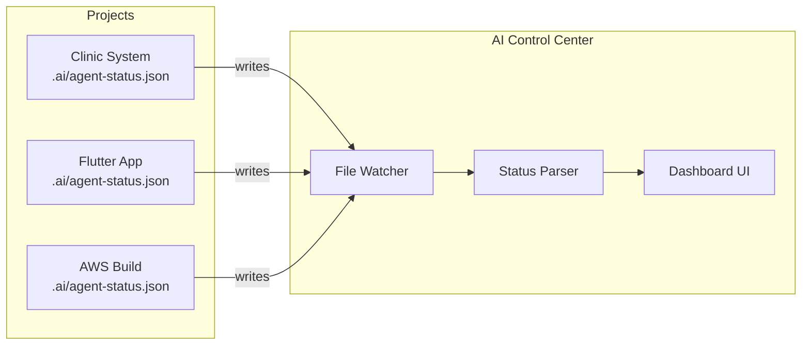
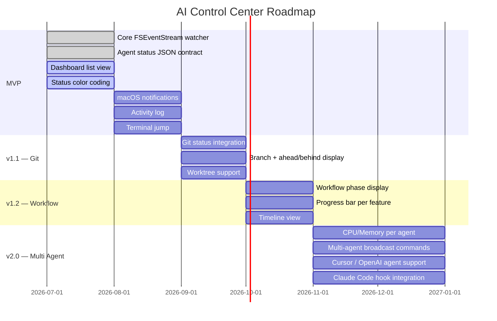

# AI Control Center

> **AI Development Operating System for macOS**  
> Monitor and manage all your AI agents — in one place, at a glance.


---

## The Problem

Modern AI-assisted development means running multiple agent sessions at once.

On any given day, a developer might have:

- `Claude Code` working on a Clinic System backend
- `Claude Code` refactoring a Flutter app
- `Claude Code` writing Terraform for AWS
- `Cursor Agent` reviewing a CMS PR
- Another session generating tests

**That's 5–10 terminal windows, all running in parallel.**

And you have no idea what's happening in any of them.

```
Is Claude thinking?     → Switch to Terminal 3
Did the command fail?   → Switch to Terminal 7
Is it waiting for me?   → Switch to Terminal 1, 2, 4...
Which project is stuck? → ???
```

You end up context-switching constantly — not between *tasks*, but between *terminals*. Your cognitive overhead isn't development. It's tab management.

**This is the problem AI Control Center is built to solve.**

---

## Concept

AI Control Center is not a "Claude Code wrapper."

It is an **AI Development Operating System**.

```
┌─────────────────────────────────────────────────────┐
│                                                     │
│   You open the dashboard.                           │
│   In 5 seconds, you know:                           │
│                                                     │
│     ● Which agents are running                      │
│     ● Which are waiting for your input              │
│     ● Which projects are in danger                  │
│     ● Which just completed                          │
│                                                     │
│   You click one. You're there.                      │
│                                                     │
└─────────────────────────────────────────────────────┘
```

A single, beautiful macOS app that gives you a mission-control view of your entire AI development ecosystem — across every project, every agent, every session.

---

## Architecture Philosophy

### The Core Principle: File-Based Status, Not Terminal Parsing

Many "AI monitoring" tools try to scrape terminal output. This approach is fragile, tightly coupled to each agent's internal implementation, and breaks the moment the agent changes its output format.

AI Control Center takes a different approach.

**Agents write. The dashboard reads.**



Each project maintains an `.ai/` directory. The agent running in that project writes its current status to `agent-status.json`. AI Control Center watches those files using `FSEventStream` — Apple's native file system event API — and reflects changes in real time.

This means:
- **Zero coupling** to any specific AI tool's internals
- **Extensible** — any agent that can write a JSON file can integrate
- **Reliable** — file watching is a solved, stable macOS primitive
- **Fast** — FSEventStream delivers events in milliseconds

---

## Features

### MVP

#### Dashboard
A single-screen view of all active AI agents.

| Column | Description |
|--------|-------------|
| **Project** | Name of the project being worked on |
| **Agent** | The AI tool running (Claude Code, Cursor, etc.) |
| **Status** | Current agent state with color coding |
| **Elapsed** | Time since last state change |
| **Current Task** | What the agent is doing right now |
| **Git Branch** | Active branch for context |

#### Status Indicators

```
● Idle              Gray    — Agent is ready, nothing running
● Thinking          Blue    — LLM is generating a response
● Running Command   Yellow  — Executing shell commands
● Waiting for User  Amber   — Input or permission required
● Completed         Green   — Task finished successfully
● Error             Red     — Something went wrong
```

Designed to be scannable at a glance. No reading required.

#### Notifications
Native macOS notifications triggered by meaningful state changes:

- `Review Finished` — Agent completed a code review
- `Tests Passed` — Test suite ran successfully
- `Permission Required` — Agent needs your approval to proceed
- `Command Failed` — An execution error occurred
- `Task Completed` — Agent finished its assigned work

#### Activity Log
A per-agent timeline showing the history of state transitions:

```
14:05  ●  Running Tests
14:08  ●  Waiting for User
14:12  ●  Thinking
14:20  ●  Completed
```

#### Terminal Jump
Click any agent row to immediately switch focus to its terminal window.

### Roadmap Features

#### .ai/ Project Integration
Standardized status contract for any project:

```json
// .ai/agent-status.json
{
  "agent": "claude-code",
  "status": "thinking",
  "task": "Refactoring AuthService",
  "progress": 0.6,
  "branch": "feature/auth-refactor",
  "started_at": "2026-07-28T09:15:00Z",
  "updated_at": "2026-07-28T09:42:00Z"
}
```

#### Workflow Visualization
See which phase of development is active:

```
[ Spec ] → [ Plan ] → [ Coding ] → [ Review ] → [ Testing ] → [ Done ]
                           ▲
                      currently here
```

#### Progress Tracking
Feature-level progress bars:

```
Auth Refactor     ████████░░  80%
API Integration   ████░░░░░░  40%
Test Coverage     ██░░░░░░░░  20%
```

#### Git Integration
Real-time repository status alongside each agent:

- Current branch
- Commits ahead / behind origin
- Changed file count
- Uncommitted work indicator

#### Worktree Support
Multiple branches of the same repository displayed side by side — essential for parallel feature development.

#### Resource Monitor
CPU and memory usage per AI process, so you know when an agent is thrashing your machine.

#### Timeline View
A Gantt-style history of agent activity across all projects — useful for retrospectives and understanding where time was spent.

#### Multi-Agent Commands
Broadcast instructions across all running agents:

```
⌘ Stop All Agents
⌘ Start Review Phase
⌘ Pull & Sync All
```

---

## Architecture Overview

```mermaid
graph TB
    subgraph macOS App — AI Control Center
        direction TB
        UI[SwiftUI Dashboard]
        VM[AgentViewModel\nObservableObject]
        WM[WatcherManager\nFSEventStream]
        NM[NotificationManager\nUNUserNotificationCenter]
        PM[ProjectManager]

        UI <-->|@Published| VM
        VM --> WM
        VM --> NM
        VM --> PM
    end

    subgraph File System
        direction TB
        P1[~/projects/clinic/.ai/agent-status.json]
        P2[~/projects/flutter-app/.ai/agent-status.json]
        P3[~/projects/aws/.ai/agent-status.json]
    end

    WM -->|FSEventStream| P1
    WM -->|FSEventStream| P2
    WM -->|FSEventStream| P3

    subgraph External Agents
        CC[Claude Code]
        CU[Cursor Agent]
        OA[OpenAI Agent]
    end

    CC -->|writes| P1
    CU -->|writes| P2
    OA -->|writes| P3
```

### Key Design Decisions

| Decision | Rationale |
|----------|-----------|
| **SwiftUI + macOS native** | Performance, look & feel, Apple HIG compliance, no Electron overhead |
| **FSEventStream** for file watching | Apple's recommended low-level API, sub-millisecond latency, battery efficient |
| **JSON status files** as the integration contract | Decoupled from any specific agent implementation |
| **No terminal scraping** | Terminal output formats are unstable and agent-specific |
| **Observable / Combine** for state | Native reactive patterns, no third-party reactive library needed |

---

## Directory Structure

```
ai-control-center/
│
├── AIControlCenter.xcodeproj/
│
├── AIControlCenter/
│   ├── App/
│   │   ├── AIControlCenterApp.swift       # Entry point
│   │   └── AppDelegate.swift              # NSApp lifecycle
│   │
│   ├── Dashboard/
│   │   ├── DashboardView.swift            # Main list view
│   │   ├── AgentRowView.swift             # Single agent row
│   │   ├── StatusBadgeView.swift          # Color-coded status pill
│   │   └── DashboardViewModel.swift       # Aggregated state
│   │
│   ├── Detail/
│   │   ├── AgentDetailView.swift          # Activity log + detail
│   │   └── ActivityTimelineView.swift     # Timeline component
│   │
│   ├── Core/
│   │   ├── Models/
│   │   │   ├── Agent.swift                # Agent domain model
│   │   │   ├── AgentStatus.swift          # Status enum + colors
│   │   │   ├── AgentStatusFile.swift      # Decodable JSON contract
│   │   │   └── Project.swift              # Project domain model
│   │   │
│   │   ├── Services/
│   │   │   ├── FileWatcherService.swift   # FSEventStream wrapper
│   │   │   ├── ProjectScanner.swift       # Discovers .ai/ dirs
│   │   │   ├── StatusParser.swift         # JSON → Agent model
│   │   │   └── NotificationService.swift  # UNUserNotification
│   │   │
│   │   └── Extensions/
│   │       ├── Color+Status.swift
│   │       └── Date+Elapsed.swift
│   │
│   ├── Settings/
│   │   ├── SettingsView.swift
│   │   └── SettingsViewModel.swift
│   │
│   └── Resources/
│       ├── Assets.xcassets/
│       └── Info.plist
│
├── .ai/                                   # This project's own status
│   └── agent-status.json
│
└── README.md
```

---

## Agent Status Contract

Any agent that writes the following JSON to `.ai/agent-status.json` in its project root will appear automatically in AI Control Center.

```json
{
  "schema_version": "1.0",
  "agent": "claude-code",
  "status": "thinking",
  "task": "Refactoring AuthService to use JWT",
  "workflow_phase": "coding",
  "progress": 0.65,
  "branch": "feature/auth-jwt",
  "worktree": "/Users/me/projects/clinic",
  "started_at": "2026-07-28T09:00:00Z",
  "updated_at": "2026-07-28T09:42:17Z"
}
```

### Status Values

| Value | Meaning |
|-------|---------|
| `idle` | Agent is ready and waiting |
| `thinking` | LLM is generating a response |
| `running_command` | Shell command is executing |
| `waiting_user` | Input or approval required |
| `completed` | Task finished |
| `error` | Agent encountered an error |

This contract is intentionally minimal. Fields are optional beyond `agent` and `status`. Future versions will add fields without breaking existing integrations.

---

## Supported Agents (Planned)

| Agent | Status |
|-------|--------|
| Claude Code | MVP target |
| Cursor Agent | Planned |
| OpenAI Codex / GPT-4 CLI | Planned |
| Gemini CLI | Planned |
| Aider | Planned |
| Custom / Any agent | Supported via JSON contract |

---

## Development

### Requirements

- macOS 14.0 Sonoma or later
- Xcode 16+
- Swift 6.0+

### Getting Started

```bash
git clone https://github.com/yourhandle/ai-control-center.git
cd ai-control-center
open AIControlCenter.xcodeproj
```

Press `⌘R` to build and run.

### Adding a Test Project

To see the dashboard in action during development, create a mock status file:

```bash
mkdir -p ~/projects/my-project/.ai
cat > ~/projects/my-project/.ai/agent-status.json << 'EOF'
{
  "schema_version": "1.0",
  "agent": "claude-code",
  "status": "thinking",
  "task": "Writing unit tests",
  "branch": "feature/tests",
  "started_at": "2026-07-28T09:00:00Z",
  "updated_at": "2026-07-28T09:15:00Z"
}
EOF
```

AI Control Center will detect it automatically.

---

## Roadmap



### Milestone Summary

| Version | Theme | Key Deliverable |
|---------|-------|-----------------|
| **MVP** | Visibility | See all agents, status at a glance |
| **v1.1** | Context | Git branch, changes, worktree |
| **v1.2** | Progress | Workflow phase, feature progress |
| **v2.0** | Control | Multi-agent commands, resource usage |

---

## Contributing

This project is in early MVP stage. Contributions are welcome, particularly:

- **Agent integrations** — If you write a hook or adapter for a new agent, please open a PR
- **Status contract feedback** — Thoughts on the `.ai/agent-status.json` schema
- **macOS UI/UX** — SwiftUI improvements, animations, accessibility

### Guidelines

1. Keep Apple framework dependencies first — third-party libraries require strong justification
2. No Electron, no web views — this is a native macOS application
3. The file-watching architecture is non-negotiable — no terminal scraping
4. Follow Apple Human Interface Guidelines
5. Every PR should include a description of the user-visible change

### Opening Issues

Bug reports, feature requests, and schema proposals are all welcome via GitHub Issues. For new agent integrations, please include:
- The agent name and version
- How it can write to a file (hooks, config, plugin, etc.)
- A sample `agent-status.json` output

---

## Vision

The way we develop software is changing faster than our tooling.

We moved from one editor to many windows. From one language to many services. From one team to many agents.

But our workflow visibility hasn't caught up. We still switch between tabs and terminals, scanning for state. We lose context. We miss errors. We wait without knowing we should act.

**AI Control Center is the mission control that AI-assisted development has been missing.**

In the near future, a developer's workflow will look like this:

1. Open AI Control Center
2. See every agent across every project — at a glance
3. Know immediately what needs attention
4. Click to jump where you're needed
5. Close the loop

Not because AI is doing everything — but because you can finally see everything AI is doing.

The goal is not to automate development. It is to give the human developer **full situational awareness** in an environment where AI agents are doing increasingly complex, parallel, long-running work.

> *Build more. Context-switch less.*

---

## License

MIT License

Copyright (c) 2026 AI Control Center Contributors

Permission is hereby granted, free of charge, to any person obtaining a copy of this software and associated documentation files (the "Software"), to deal in the Software without restriction, including without limitation the rights to use, copy, modify, merge, publish, distribute, sublicense, and/or sell copies of the Software, and to permit persons to whom the Software is furnished to do so, subject to the following conditions:

The above copyright notice and this permission notice shall be included in all copies or substantial portions of the Software.

THE SOFTWARE IS PROVIDED "AS IS", WITHOUT WARRANTY OF ANY KIND, EXPRESS OR IMPLIED, INCLUDING BUT NOT LIMITED TO THE WARRANTIES OF MERCHANTABILITY, FITNESS FOR A PARTICULAR PURPOSE AND NONINFRINGEMENT. IN NO EVENT SHALL THE AUTHORS OR COPYRIGHT HOLDERS BE LIABLE FOR ANY CLAIM, DAMAGES OR OTHER LIABILITY, WHETHER IN AN ACTION OF CONTRACT, TORT OR OTHERWISE, ARISING FROM, OUT OF OR IN CONNECTION WITH THE SOFTWARE OR THE USE OR OTHER DEALINGS IN THE SOFTWARE.

---

<div align="center">
  <sub>Built for developers who work with AI agents every day.</sub>
</div>
