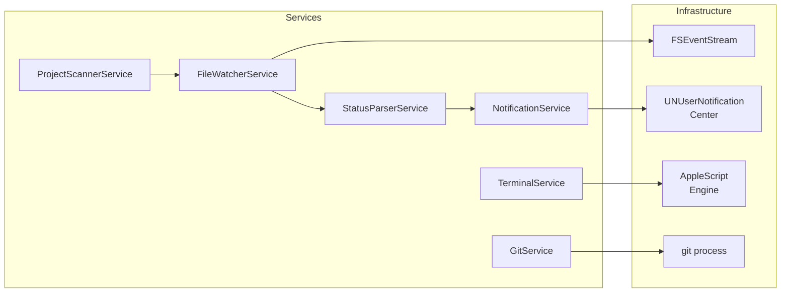
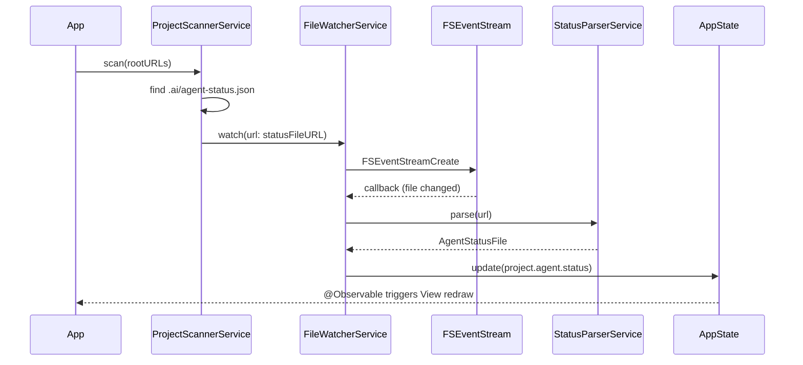

# Architecture

AI Control Center の詳細アーキテクチャ仕様書。

---

## 1. レイヤ構成

```
┌─────────────────────────────────────────────┐
│           Presentation Layer                │
│   SwiftUI Views + ViewModels (@Observable)  │
├─────────────────────────────────────────────┤
│             Domain Layer                    │
│   Models + UseCases + State                 │
├─────────────────────────────────────────────┤
│            Service Layer                    │
│   FileWatcher / Scanner / Parser / Notif    │
├─────────────────────────────────────────────┤
│          Infrastructure Layer               │
│   FSEventStream / UserNotifications / AppleScript │
└─────────────────────────────────────────────┘
```

### 各レイヤの責務

| レイヤ | 責務 | Swift要素 |
|--------|------|-----------|
| Presentation | 画面描画・ユーザーインタラクション | SwiftUI View, @Observable ViewModel |
| Domain | ビジネスロジック・状態管理 | struct / enum / actor |
| Service | 外部システムとのやりとり | class (Service), async/await |
| Infrastructure | OS API ラッパー | FSEventStream, UNUserNotificationCenter |

---

## 2. MVVM 構成

```mermaid
graph TB
    subgraph Presentation
        DV[DashboardView]
        ADV[AgentDetailView]
        SV[SettingsView]
        MBV[MenuBarView]
    end

    subgraph ViewModels
        DVM[DashboardViewModel\n@Observable @MainActor]
        ADVM[AgentDetailViewModel\n@Observable @MainActor]
        SVM[SettingsViewModel\n@Observable @MainActor]
        MBVM[MenuBarViewModel\n@Observable @MainActor]
    end

    subgraph AppState
        AS[AppState\n@Observable @MainActor\nSingleton]
    end

    DV --> DVM
    ADV --> ADVM
    SV --> SVM
    MBV --> MBVM

    DVM --> AS
    ADVM --> AS
    SVM --> AS
    MBVM --> AS
```

### ViewModel 設計方針

- すべての ViewModel は `@Observable` + `@MainActor` で宣言
- ViewModel は `AppState` を参照するが、`AppState` は ViewModel を知らない
- ViewModel はビジネスロジックを持たない — Service を呼ぶだけ
- `private(set)` で外部からの直接書き込みを禁止

```
// 方針例（コードではなく設計指針）
DashboardViewModel
  - projects: [Project]  ← AppState から派生
  - sortOrder: SortOrder
  - filterStatus: AgentStatus?
  - func refresh()
  - func jumpToTerminal(agent: Agent)
```

---

## 3. Service 構成



### Service 責務一覧

| Service | 責務 | 主要メソッド |
|---------|------|-------------|
| `ProjectScannerService` | Root ディレクトリを走査し `.ai/agent-status.json` を発見 | `scan(rootURL:)`, `startWatching()` |
| `FileWatcherService` | FSEventStream で特定ファイルの変更を監視 | `watch(url:)`, `unwatch(url:)` |
| `StatusParserService` | JSON → `AgentStatusFile` のデコード | `parse(url:)` |
| `NotificationService` | 状態変化をユーザーに通知 | `send(event:)`, `requestPermission()` |
| `TerminalService` | 対象ターミナルへフォーカス移動 | `activate(provider:workingDir:)` |
| `GitService` | git コマンドを非同期実行して `GitStatus` を返す | `status(at:)` |

---

## 4. FileWatcher 構成



### FSEventStream ラッパー設計

```
FileWatcherService
  - private var streams: [URL: FSEventStreamRef]
  - func watch(url: URL) → AsyncStream<FileChangeEvent>
  - func unwatch(url: URL)
  - private func createStream(for url: URL) → FSEventStreamRef

FileChangeEvent
  - url: URL
  - flags: FSEventStreamEventFlags
  - timestamp: Date
```

**Design Decision #1**: `FSEventStream` は `AsyncStream` にブリッジする。  
Combine の `Publisher` にすることも検討したが、Swift 6 では `async/await` + `AsyncStream` が Actor 境界を超える際に安全であり、Combine より依存が少ない。`FSEventStream` のコールバックは `DispatchQueue` ベースで動作するため、`AsyncStream.Continuation` を使って `Task` に橋渡しする。

---

## 5. 状態管理

```mermaid
graph TB
    subgraph AppState singleton
        PR[projects: [Project]]
        SE[settings: Settings]
        NQ[notificationQueue: [AppNotification]]
    end

    subgraph Project
        AG[agents: [Agent]]
        GS[gitStatus: GitStatus?]
    end

    subgraph Agent
        ST[status: AgentStatus]
        AC[activities: [Activity]]
        WF[workflowPhase: WorkflowPhase?]
    end

    PR --> AG
    AG --> ST
    AG --> AC
    AG --> WF
```

### AppState

```
@Observable
@MainActor
final class AppState {
    // 単一の真実の源泉
    private(set) var projects: [Project] = []
    private(set) var settings: Settings = Settings()
    private(set) var pendingNotifications: [AppNotification] = []

    // Services (DI)
    let scannerService: ProjectScannerService
    let watcherService: FileWatcherService
    let notificationService: NotificationService

    // Internal mutation — ServiceLayer からのみ呼ばれる
    func upsertProject(_ project: Project)
    func updateAgentStatus(projectID:, status:)
    func appendActivity(projectID:, activity:)
    func removeProject(id:)
}
```

**Design Decision #2**: `AppState` はシングルトンではなく、`@Environment` で DI する。  
`@Observable` の場合 `@EnvironmentObject` ではなく `@Environment(AppState.self)` を使用（Swift 5.9+）。テスト時にモックと差し替え可能にするため。

---

## 6. 非同期処理方針

### 原則

| 操作 | 使用パターン |
|------|------------|
| ファイル読み込み | `async throws` 関数 |
| FSEventStream コールバック | `AsyncStream` → `for await` |
| UI 更新 | `@MainActor` で保証 |
| バックグラウンド処理 | `Task.detached` または `actor` |
| git コマンド | `Process` + `async/await` ラッパー |
| タイムアウト | `withTimeout` ラッパー関数 |

### Task ライフサイクル

```
AppState.startMonitoring()
  └─ Task { // structured concurrency
       for await event in watcherService.events {
           await handleEvent(event)  // @MainActor
       }
     }
```

アプリ終了時は `task.cancel()` で自動的にクリーンアップ。

### Swift 6 Sendable 方針

- `struct` モデルはすべて `Sendable` に準拠
- `class` を使う場合は `actor` への昇格を検討
- サービス層は `final class` + `@unchecked Sendable`（内部で Actor を使用）
- UI 層は `@MainActor` で隔離

---

## 7. Observation vs Combine

**方針: Observation を主軸、Combine は使わない**

| 用途 | 採用技術 | 理由 |
|------|---------|------|
| ViewModel → View 更新 | `@Observable` | Swift 6 標準、ボイラープレート不要 |
| Service → ViewModel | `async/await` + `AsyncStream` | Actor 境界を安全に越えられる |
| FSEventStream ブリッジ | `AsyncStream.Continuation` | Combine なしで同等機能 |
| タイマー | `AsyncStream` + `Task.sleep` | Combine `Timer.publish` 不要 |

Combine は iOS/macOS 13+ で使えるが、Swift 6 の Actor モデルとの統合が複雑になるため、新規コードでは採用しない。

---

## 8. データフロー

```mermaid
flowchart TD
    A[.ai/agent-status.json\n変更] --> B[FSEventStream\nコールバック]
    B --> C[AsyncStream\nFileChangeEvent]
    C --> D[StatusParserService\nJSON decode]
    D --> E{変更あり?}
    E -->|Yes| F[AppState.updateAgentStatus]
    E -->|No| G[スキップ]
    F --> H[Activity 追記]
    F --> I[NotificationService\n状態変化チェック]
    I --> J{通知すべき?}
    J -->|Yes| K[UNUserNotificationCenter]
    J -->|No| L[スキップ]
    F --> M[@Observable\n自動伝播]
    M --> N[SwiftUI View\n再描画]
```

---

## 9. エラー処理

### エラー分類

```
AppError
  ├─ FileWatcher
  │   ├─ watchFailed(url: URL, reason: String)
  │   └─ streamCreationFailed
  ├─ StatusParsing
  │   ├─ fileNotFound(url: URL)
  │   ├─ decodingFailed(url: URL, error: DecodingError)
  │   └─ unsupportedSchemaVersion(version: String)
  ├─ ProjectDiscovery
  │   ├─ rootNotAccessible(url: URL)
  │   └─ permissionDenied(url: URL)
  ├─ Terminal
  │   ├─ providerNotAvailable(name: String)
  │   └─ activationFailed(reason: String)
  └─ Git
      ├─ notARepository(url: URL)
      └─ commandFailed(exitCode: Int, stderr: String)
```

### エラー処理方針

- `StatusParsing.decodingFailed` → ログ記録、そのプロジェクトのみスキップ（他は継続）
- `FileWatcher.watchFailed` → UI に警告表示、再試行ボタン提供
- `ProjectDiscovery.permissionDenied` → Settings でパスを変更するよう案内
- すべてのエラーは `AppState.recentErrors: [AppError]` に記録

---

## 10. 将来拡張方法

### 新 Agent タイプの追加

```
1. AgentType enum に値を追加
2. agent-status.json の "agent" フィールドに対応する文字列を登録
3. StatusParserService は変更不要（JSON の schema は共通）
4. アイコン/色は AgentType の computed property で追加
```

### 新 Terminal の追加

```
1. TerminalProvider プロトコルを実装する struct を作成
2. TerminalRegistry に登録
3. 既存コードの変更不要
```

### 新ステータス追加

```
1. AgentStatus enum に値を追加
2. status-contract.md を更新
3. Color+Status extension に色を追加
4. 通知ルールを notification.md に追加して NotificationService に実装
```

### Plugin 構想（v3.0+）

将来的には `TerminalProvider` や `AgentParser` を動的ロードできるプラグインシステムに昇格させることも可能。現時点では静的コンパイルで十分。

---

## ディレクトリとレイヤのマッピング

```
AIControlCenter/
├── App/                        # Infrastructure Layer
│   ├── AIControlCenterApp.swift
│   └── AppDelegate.swift
│
├── Dashboard/                  # Presentation Layer
├── Detail/                     # Presentation Layer
├── Settings/                   # Presentation Layer
├── MenuBar/                    # Presentation Layer
│
├── Core/
│   ├── State/                  # Domain Layer
│   │   └── AppState.swift
│   ├── Models/                 # Domain Layer
│   ├── Services/               # Service Layer
│   └── Infrastructure/         # Infrastructure Layer
│       ├── FSEventStreamWrapper.swift
│       └── ProcessRunner.swift
```
