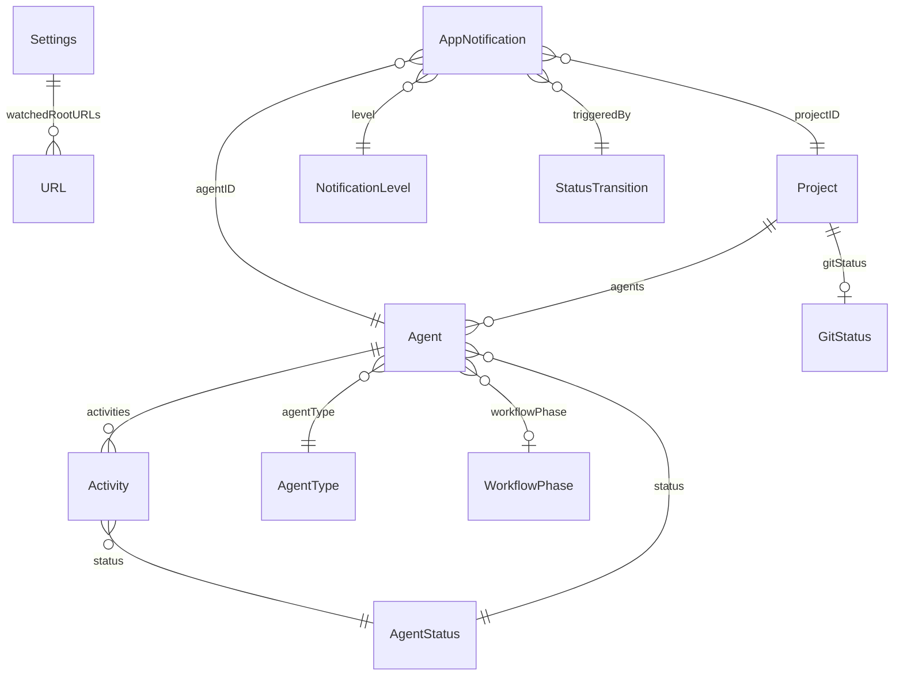

# Data Model

AI Control Center で使用するすべてのモデル定義。

Swift 6 準拠。すべての `struct` は `Sendable`。`enum` は `Codable` + `Sendable`。

---

## モデル一覧

| モデル | 種別 | 説明 |
|--------|------|------|
| `Project` | struct | 監視対象プロジェクト |
| `Agent` | struct | プロジェクト内で動作する AI エージェント |
| `AgentType` | enum | エージェントの種類 |
| `AgentStatus` | enum | エージェントの現在状態 |
| `WorkflowPhase` | enum | 開発フェーズ |
| `Activity` | struct | エージェントの状態変化ログ1件 |
| `AppNotification` | struct | アプリ内通知 |
| `NotificationLevel` | enum | 通知の重要度 |
| `GitStatus` | struct | Git リポジトリの状態 |
| `Settings` | struct | アプリ設定 |
| `TerminalProviderType` | enum | 使用するターミナルアプリ |
| `AgentStatusFile` | struct | agent-status.json の Decodable 表現 |

---

## Project

プロジェクトの最上位エンティティ。1プロジェクトにつき複数のエージェントが存在しうる（Worktree 対応）。

| プロパティ | 型 | 必須 | 説明 |
|-----------|------|------|------|
| `id` | `UUID` | ✅ | 内部識別子 |
| `name` | `String` | ✅ | プロジェクト名（ディレクトリ名から自動生成） |
| `rootURL` | `URL` | ✅ | プロジェクトルートの絶対パス |
| `statusFileURL` | `URL` | ✅ | `.ai/agent-status.json` のパス（`rootURL` から導出） |
| `agents` | `[Agent]` | ✅ | このプロジェクトで動作中のエージェント一覧 |
| `gitStatus` | `GitStatus?` | ❌ | Git リポジトリ情報（非 Git の場合 nil） |
| `isGitRepository` | `Bool` | ✅ | `.git` または `.git` ファイルが存在するか |
| `discoveredAt` | `Date` | ✅ | Dashboard が検出した日時 |
| `lastSeenAt` | `Date` | ✅ | 最後にステータスファイルを読んだ日時 |
| `isReachable` | `Bool` | ✅ | ファイルシステム上でアクセス可能か |

### computed プロパティ（実装参考）

```
// 最新の Agent を返す（updatedAt が最新のもの）
var primaryAgent: Agent? → agents.max(by: \.updatedAt)

// プロジェクト全体の最重要ステータス
var aggregatedStatus: AgentStatus → agents の中で最高優先度のステータス
```

---

## Agent

プロジェクト内で動作する AI エージェントの1インスタンス。

| プロパティ | 型 | 必須 | 説明 |
|-----------|------|------|------|
| `id` | `UUID` | ✅ | 内部識別子 |
| `projectID` | `UUID` | ✅ | 親 Project の ID |
| `agentType` | `AgentType` | ✅ | エージェントの種類 |
| `status` | `AgentStatus` | ✅ | 現在の状態 |
| `currentTask` | `String?` | ❌ | 現在実行中のタスク説明 |
| `workflowPhase` | `WorkflowPhase?` | ❌ | 開発フェーズ（planning / coding / review など） |
| `progress` | `Double?` | ❌ | 0.0〜1.0 の進捗（nil = 不明） |
| `branch` | `String?` | ❌ | 現在の Git ブランチ名 |
| `worktreePath` | `URL?` | ❌ | Worktree を使用している場合のパス |
| `startedAt` | `Date?` | ❌ | タスク開始日時 |
| `updatedAt` | `Date` | ✅ | ステータスが最後に更新された日時 |
| `activities` | `[Activity]` | ✅ | 状態変化の履歴（新しい順） |
| `schemaVersion` | `String` | ✅ | 読み込んだ agent-status.json のスキーマバージョン |

### computed プロパティ

```
// 前のステータス（通知判定に使用）
var previousStatus: AgentStatus? → activities.first?.status

// 現在のステータスが継続している時間
var elapsedSinceLastChange: TimeInterval → Date.now - updatedAt

// 注意が必要か（ユーザーアクション待ち or エラー）
var needsAttention: Bool → status == .waitingUser || status == .error
```

---

## AgentType

| ケース | rawValue | 説明 |
|--------|----------|------|
| `claudeCode` | `"claude-code"` | Claude Code CLI |
| `cursor` | `"cursor"` | Cursor Agent |
| `openaiCodex` | `"openai-codex"` | OpenAI Codex / GPT-4 CLI |
| `geminiCLI` | `"gemini-cli"` | Gemini CLI |
| `aider` | `"aider"` | Aider |
| `unknown` | `"unknown"` | 未知のエージェント（フォールバック） |

各ケースは以下の computed プロパティを持つ:

| プロパティ | 型 | 例 |
|-----------|----|----|
| `displayName` | `String` | `"Claude Code"` |
| `iconName` | `String` | SF Symbols または Assets のアイコン名 |
| `accentColor` | `Color` | エージェント固有のブランドカラー |

---

## AgentStatus

エージェントの現在の状態を表す列挙型。

| ケース | rawValue | 表示名 | カラー | 優先度 |
|--------|----------|--------|--------|--------|
| `idle` | `"idle"` | Idle | gray | 0 |
| `thinking` | `"thinking"` | Thinking | blue | 1 |
| `runningCommand` | `"running_command"` | Running | yellow | 2 |
| `waitingUser` | `"waiting_user"` | Waiting | orange | 4 |
| `completed` | `"completed"` | Done | green | 1 |
| `error` | `"error"` | Error | red | 5 |

**優先度**: 複数エージェントがいる場合、`aggregatedStatus` は優先度最大のものを使用。

### StatusGroup（UI フィルタ用）

```
enum StatusGroup {
    case needsAttention   // waitingUser, error
    case active           // thinking, runningCommand
    case passive          // idle, completed
}
```

---

## WorkflowPhase

開発フェーズの列挙型。agent-status.json の `workflow_phase` に対応。

| ケース | rawValue | 表示名 | アイコン |
|--------|----------|--------|---------|
| `spec` | `"spec"` | Spec | doc.text |
| `planning` | `"planning"` | Plan | list.bullet.clipboard |
| `coding` | `"coding"` | Coding | chevron.left.forwardslash.chevron.right |
| `review` | `"review"` | Review | eye |
| `testing` | `"testing"` | Testing | checkmark.seal |
| `debugging` | `"debugging"` | Debug | ant |
| `deploying` | `"deploying"` | Deploy | arrow.up.to.line |

---

## Activity

エージェントの状態変化を記録するログエントリ。

| プロパティ | 型 | 必須 | 説明 |
|-----------|------|------|------|
| `id` | `UUID` | ✅ | 内部識別子 |
| `agentID` | `UUID` | ✅ | 対象エージェントの ID |
| `status` | `AgentStatus` | ✅ | このエントリ時点のステータス |
| `task` | `String?` | ❌ | このステータス中に実行していたタスク |
| `workflowPhase` | `WorkflowPhase?` | ❌ | このステータス中のフェーズ |
| `timestamp` | `Date` | ✅ | ステータスが変化した日時 |
| `duration` | `TimeInterval?` | ❌ | このステータスが継続した時間（次の Activity から逆算） |

### 保持数の制限

各 Agent につき最大 **200件** の Activity を保持。超過分は古い順に削除。

### 格納順序とパフォーマンス

`activities` 配列は **古い順（追記順）** で保持する。

```
activities[0]   ← 最も古いエントリ（最初に状態変化した記録）
activities[N-1] ← 最新のエントリ（直近の状態変化）
```

**理由**: 末尾への `append` は O(1)（amortized）。先頭への `insert(at: 0)` は O(N) のメモリシフトが発生するため避ける。  
UI（ActivityTimelineView）では「新しい順」に表示するが、これは View 側で `activities.reversed()` を呼ぶことで対処する。`ReversedCollection` はコピーが発生しない O(1) 操作であるため、パフォーマンスに影響しない。

最大件数超過時の `removeFirst()`（最古エントリ削除）は O(N) だが、200件を超えてから1回だけ発生するため実用上問題なし。`architecture.md § 8.5` も参照。

---

## AppNotification

アプリが生成した通知のインスタンス。`NotificationService` が作成し、`AppState` が保持。

| プロパティ | 型 | 必須 | 説明 |
|-----------|------|------|------|
| `id` | `UUID` | ✅ | 内部識別子（UNNotification の identifier に使用） |
| `projectID` | `UUID` | ✅ | 通知元プロジェクト |
| `agentID` | `UUID` | ✅ | 通知元エージェント |
| `level` | `NotificationLevel` | ✅ | 通知の重要度 |
| `title` | `String` | ✅ | 通知タイトル |
| `body` | `String` | ✅ | 通知本文 |
| `triggeredBy` | `StatusTransition` | ✅ | どの状態遷移が通知を発火させたか |
| `createdAt` | `Date` | ✅ | 通知生成日時 |
| `isRead` | `Bool` | ✅ | ユーザーが確認済みか |

---

## NotificationLevel

| ケース | 説明 | UNNotification interruptionLevel |
|--------|------|----------------------------------|
| `critical` | エラー、即時対応が必要 | `.timeSensitive` |
| `high` | ユーザー入力待ち | `.active` |
| `normal` | 完了、フェーズ変化 | `.passive` |
| `low` | 情報のみ | `.passive` |

---

## StatusTransition

通知のトリガーを表す値型。

| プロパティ | 型 | 説明 |
|-----------|------|------|
| `from` | `AgentStatus?` | 遷移前のステータス（nil = 初回） |
| `to` | `AgentStatus` | 遷移後のステータス |
| `projectName` | `String` | プロジェクト名（通知文生成用） |
| `taskName` | `String?` | タスク名（通知文生成用） |

---

## GitStatus

Git リポジトリの現在状態。

| プロパティ | 型 | 必須 | 説明 |
|-----------|------|------|------|
| `branch` | `String` | ✅ | 現在のブランチ名（detached HEAD の場合はコミットハッシュ） |
| `isDetachedHEAD` | `Bool` | ✅ | detached HEAD 状態か |
| `aheadCount` | `Int` | ✅ | origin より何コミット先行しているか |
| `behindCount` | `Int` | ✅ | origin より何コミット遅れているか |
| `stagedCount` | `Int` | ✅ | ステージ済みの変更ファイル数 |
| `unstagedCount` | `Int` | ✅ | 未ステージの変更ファイル数 |
| `untrackedCount` | `Int` | ✅ | 未追跡ファイル数 |
| `hasConflicts` | `Bool` | ✅ | マージ競合があるか |
| `lastFetchedAt` | `Date?` | ❌ | 最後に `git fetch` した日時 |
| `stashCount` | `Int` | ✅ | stash エントリ数 |

### computed プロパティ

```
var isClean: Bool → stagedCount == 0 && unstagedCount == 0 && untrackedCount == 0
var totalChanges: Int → stagedCount + unstagedCount + untrackedCount
var syncStatus: SyncStatus → .ahead / .behind / .diverged / .upToDate
```

---

## Settings

ユーザーが設定可能なアプリ設定。`UserDefaults` に永続化。

| プロパティ | 型 | デフォルト | 説明 |
|-----------|------|-----------|------|
| `watchedRootURLs` | `[URL]` | `[]` | スキャン対象のルートディレクトリ |
| `scanDepth` | `Int` | `3` | ルートからの最大スキャン深度 |
| `excludedDirectoryNames` | `[String]` | `[".git", "node_modules", ".build", "DerivedData"]` | スキャン除外ディレクトリ名 |
| `preferredTerminal` | `TerminalProviderType` | `.terminal` | デフォルトのターミナルアプリ |
| `notificationsEnabled` | `Bool` | `true` | 通知を送るか |
| `notificationLevel` | `NotificationLevel` | `.normal` | 最低通知レベル（これ未満は送らない） |
| `doNotDisturbEnabled` | `Bool` | `false` | DND モード（通知を送らない） |
| `gitIntegrationEnabled` | `Bool` | `true` | Git ステータスを取得するか |
| `gitPollInterval` | `TimeInterval` | `30` | Git ステータスのポーリング間隔（秒） |
| `showMenuBarIcon` | `Bool` | `true` | メニューバーアイコンを表示するか |
| `activityRetentionCount` | `Int` | `200` | 1エージェントあたりの Activity 保持数 |
| `launchAtLogin` | `Bool` | `false` | ログイン時に自動起動 |

---

## TerminalProviderType

| ケース | rawValue | バンドル ID | 検出方法 |
|--------|----------|------------|---------|
| `terminal` | `"terminal"` | `com.apple.Terminal` | 常に利用可能 |
| `iTerm2` | `"iterm2"` | `com.googlecode.iterm2` | NSRunningApplication で確認 |
| `warp` | `"warp"` | `dev.warp.Warp-Stable` | NSRunningApplication で確認 |
| `ghostty` | `"ghostty"` | `com.mitchellh.ghostty` | NSRunningApplication で確認 |

---

## AgentStatusFile

`agent-status.json` を `Codable` でデコードするための型。  
ドメインモデル（`Agent`）とは別に定義し、JSON 仕様変更の影響をこのレイヤで吸収する。

| プロパティ | 型 | JSON キー | 必須 | 説明 |
|-----------|------|----------|------|------|
| `schemaVersion` | `String` | `schema_version` | ✅ | スキーマバージョン |
| `agent` | `String` | `agent` | ✅ | エージェント識別子 |
| `status` | `String` | `status` | ✅ | ステータス文字列 |
| `task` | `String?` | `task` | ❌ | 現在のタスク説明 |
| `workflowPhase` | `String?` | `workflow_phase` | ❌ | 開発フェーズ |
| `progress` | `Double?` | `progress` | ❌ | 0.0〜1.0 |
| `branch` | `String?` | `branch` | ❌ | ブランチ名 |
| `worktree` | `String?` | `worktree` | ❌ | Worktree パス |
| `startedAt` | `String?` | `started_at` | ❌ | ISO 8601 日時文字列 |
| `updatedAt` | `String` | `updated_at` | ✅ | ISO 8601 日時文字列 |
| `metadata` | `[String:String]?` | `metadata` | ❌ | 将来拡張用の任意 KV |

**Design Decision #3**: `AgentStatusFile` は `String` でステータスを受け取り、`StatusParserService` が `AgentStatus` enum に変換する。不明な文字列は `.unknown` にフォールバックし、アプリをクラッシュさせない。

---

## モデル間の関係


