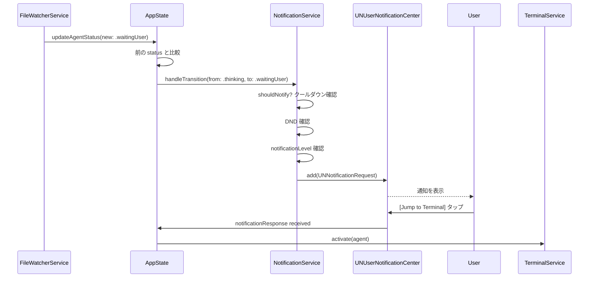

# Notification

AI Control Center の通知設計仕様書。

macOS `UserNotifications` フレームワークを使用。通知はシステムの通知センターに届く。

---

## 通知の目的

- **ユーザーを引き戻す**: エージェントがユーザーを待っているとき、すぐに気づかせる
- **状況を伝える**: タスクが完了したことを、別作業中でも把握させる
- **ノイズを作らない**: すべての状態変化を通知するとノイズになる。重要なものだけ送る

---

## 通知レベル

| レベル | 値 | 用途 | UNNotification `interruptionLevel` |
|--------|-----|------|-----------------------------------|
| Critical | 4 | 即時対応が必要 | `.timeSensitive` |
| High | 3 | 重要、なるべく早く対応 | `.active` |
| Normal | 2 | 通常の完了通知など | `.passive` |
| Low | 1 | 情報提供のみ | `.passive` |

ユーザーは Settings で「最低通知レベル」を設定できる。設定値未満の通知は送らない。

---

## 通知トリガー一覧

### Critical レベル

| トリガー | タイトル例 | 本文例 | デフォルト |
|---------|-----------|--------|-----------|
| `→ error` への遷移 | `❌ Error — Clinic System` | `Build failed: Cannot find JWTService` | ✅ 有効 |

### High レベル

| トリガー | タイトル例 | 本文例 | デフォルト |
|---------|-----------|--------|-----------|
| `→ waiting_user` への遷移 | `⏸ Waiting for you — Flutter App` | `Permission required: write to pubspec.yaml` | ✅ 有効 |

### Normal レベル

| トリガー | タイトル例 | 本文例 | デフォルト |
|---------|-----------|--------|-----------|
| `→ completed` への遷移 | `✅ Done — AWS Build` | `Infrastructure setup complete` | ✅ 有効 |
| `thinking → running_command` (初回のみ) | — | — | ❌ 無効 |

### Low レベル

| トリガー | タイトル例 | 本文例 | デフォルト |
|---------|-----------|--------|-----------|
| `workflow_phase` の変化 | `🔄 Phase Changed — CMS` | `Coding → Review` | ❌ 無効 |
| エージェント検出（新規プロジェクト） | `📁 New Project — my-app` | `Started monitoring` | ❌ 無効 |

---

## 通知しないケース

以下の遷移は **通知しない**（ノイズになるため）:

- `idle → thinking`（タスク開始。頻度が高すぎる）
- `thinking → running_command`（内部の細かい変化）
- `running_command → thinking`（同上）
- 同じステータスへの再書き込み（ステータス変化なし）
- `completed → idle`（ユーザー操作後の自動遷移）

---

## 通知の抑制

### Do Not Disturb

`Settings.doNotDisturbEnabled = true` の場合、すべての通知を送らない。  
MenuBar アイコンのバッジ（赤ドット）は引き続き表示する。

**Design Decision #9**: macOS システムの Focus / DND 設定も尊重する。  
`UNNotificationInterruptionLevel.critical` を使うと Focus をバイパスできるが、これは本当に Critical な場合（`error` 状態）のみ使用し、通常は `.timeSensitive` 以下に留める。

### クールダウン（通知抑制）

同一プロジェクトの同一ステータスへの通知は、**60秒以内に再発火しない**。

```
例:
  10:00:00 → error 通知を送信
  10:00:30 → 再度 error になった（ユーザーがリトライして再エラー）→ 抑制
  10:01:30 → 60秒経過後は再度送信
```

### まとめ通知（バッチング）

複数エージェントが同時（3秒以内）に `completed` になった場合、個別通知を束ねて1件にまとめる。

```
個別通知（バッチング前）:
  ✅ Done — Clinic System
  ✅ Done — Flutter App
  ✅ Done — AWS Build

まとめ通知（バッチング後）:
  ✅ 3 agents completed
  Clinic System, Flutter App, AWS Build
```

バッチング対象: `completed`、`error` のみ。`waiting_user` はまとめない（個別に確認したいため）。

---

## 通知アクション（UNNotificationAction）

### waiting_user 通知

```
通知本文
  ⏸ Waiting for you — Clinic System
  "Permission required: write to package.json"
  
アクション:
  [Open Dashboard]    → アプリを前面に出し、対象エージェントを選択
  [Jump to Terminal]  → 対象エージェントのターミナルにフォーカス（AppleScript）
```

### error 通知

```
通知本文
  ❌ Error — Flutter App
  "Build failed: method not found"
  
アクション:
  [Open Dashboard]    → アプリを前面に出し、対象エージェントを選択
  [View Activity Log] → Agent Detail を開く
```

### completed 通知

アクションなし（受動的な情報提供のため）。

---

## 通知識別子の設計

`UNNotificationRequest` の `identifier` は以下の形式:

```
ai-control-center.{projectID}.{status}.{timestamp-seconds}
```

例:
```
ai-control-center.550e8400-e29b-41d4-a716-446655440000.waiting_user.1722160000
```

- 同一プロジェクトの以前の通知を `UNUserNotificationCenter.removePendingNotificationRequests` で削除できる
- `{status}` を含めることで、異なる状態への遷移は別の通知として扱える

---

## NotificationService インターフェース（参考）

```
NotificationService

  // 権限リクエスト（アプリ起動時に呼ぶ）
  func requestAuthorization() async throws -> Bool

  // 状態遷移イベントを渡し、送るべき通知を判断して送信
  func handleTransition(_ transition: StatusTransition,
                        settings: Settings) async

  // 通知権限の現在状態を確認
  func authorizationStatus() async -> UNAuthorizationStatus

NotificationRule
  // 通知すべきか判断するビジネスロジック
  static func shouldNotify(transition: StatusTransition,
                            settings: Settings,
                            recentHistory: [AppNotification]) -> AppNotification?
```

---

## 通知のフロー



---

## パーミッション管理

### 初回起動時

アプリ初回起動時に通知権限をリクエストする。  
拒否された場合でも、アプリの機能（Dashboard、メニューバー）は引き続き動作する。

```
起動 → 通知の説明ダイアログ（カスタム）→ システム権限ダイアログ → 許可/拒否
```

### 権限が拒否された場合

Settings > Notifications タブに以下のバナーを表示:

```
⚠ Notifications are disabled.
Open System Settings to enable them.
[Open System Settings]
```

---

## テスト用の仕様

`NotificationRule.shouldNotify` は純粋関数として実装し、ユニットテスト可能にする。

テストケース例:
- `idle → waiting_user`: 通知あり
- `waiting_user → waiting_user`: 変化なし → 通知なし
- `thinking → completed`: 通知あり（Settings.notificationsEnabled = true の場合）
- `thinking → completed` + DND 有効: 通知なし
- `error → error` 30秒以内: クールダウンで抑制
- 3つのエージェントが同時 `completed`: まとめ通知1件
