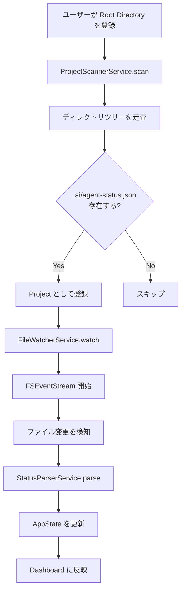
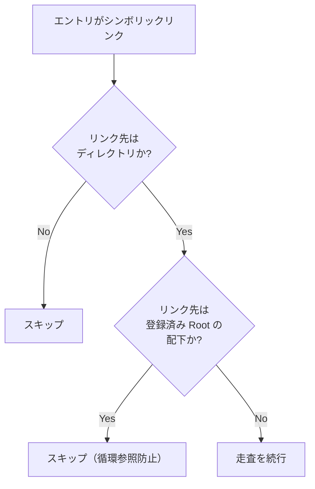

# Project Discovery

AI Control Center がプロジェクトを検出し、監視を開始するまでのフロー仕様。

---

## 概要



---

## 1. Root Directory の登録

### ユーザーフロー

1. Settings > General > `+ Add Directory` をクリック
2. `NSOpenPanel` が開く（ファイル選択不可、ディレクトリのみ）
3. ユーザーがディレクトリを選択して OK
4. `Settings.watchedRootURLs` に追加
5. 即座にスキャンを開始

### セキュリティ: App Sandbox と Security-Scoped Bookmarks

macOS App Sandbox を有効にする場合（推奨）、選択したディレクトリへのアクセスを維持するために **Security-Scoped Bookmark** を使用する。

```
登録フロー:
  1. NSOpenPanel で URL を取得
  2. url.startAccessingSecurityScopedResource()
  3. url.bookmarkData(options: .withSecurityScope) で bookmark を生成
  4. UserDefaults に bookmark データを保存
  5. アプリ再起動時は bookmark から URL を復元

終了フロー:
  1. url.stopAccessingSecurityScopedResource()
```

**Design Decision #6**: MVP では App Sandbox を無効にして開発速度を優先する。  
v1.0 リリース時に Sandbox + Security-Scoped Bookmark 対応を行う。  
Mac App Store 配布を予定している場合は Sandbox が必須。

### 複数 Root Directory のサポート

- 複数登録可能（上限なし）
- 同じパスの二重登録は Settings で弾く
- 子ディレクトリと親ディレクトリが両方登録されている場合: **より具体的な方（子）を優先**、親側からの検出は除外

---

## 2. ディレクトリ走査アルゴリズム

### 走査方針

`FileManager.contentsOfDirectory` を用いた **BFS（幅優先探索）**。  
DFS は深いネストで長時間かかるリスクがあるため BFS を採用。

```
walk(rootURL, currentDepth=0, maxDepth=Settings.scanDepth):
  entries = FileManager.contentsOfDirectory(at: rootURL)
  for entry in entries:
    if shouldExclude(entry): continue
    if isSymlink(entry): handle separately
    
    statusFile = entry/.ai/agent-status.json
    if statusFile.exists:
      register(entry, statusFile)
      continue  // これ以上深く潜らない（.ai を持つ dir が最上位 project）
    
    if currentDepth < maxDepth && isDirectory(entry):
      walk(entry, currentDepth + 1, maxDepth)
```

### 重要: .ai を持つディレクトリ以下は潜らない

`.ai/agent-status.json` が見つかった時点で、そのディレクトリを Project として登録し、  
サブディレクトリへの走査は行わない。プロジェクトのネストは想定しない。

---

## 3. 除外ルール

以下のディレクトリはスキャン対象から除外する。

### デフォルト除外リスト

```
.git
.svn
node_modules
.build
.swiftpm
DerivedData
.gradle
target           # Rust / Maven
__pycache__
.venv
venv
.tox
vendor
Pods
Carthage
.yarn
.pnpm
dist
build
out
.next
.nuxt
```

### 除外ロジック

- ディレクトリ名の完全一致（パスではなくベース名）
- ユーザーが Settings で追加・削除可能
- 大文字小文字を区別しない（`Node_Modules` も除外）

### 隠しディレクトリ（`.` で始まる）

- `.ai` 以外の隠しディレクトリはすべてスキップ
- `.ai` は特別扱いで許可

---

## 4. シンボリックリンクの扱い



**Design Decision #7**: シンボリックリンクはデフォルトで **追わない**（MVP）。  
循環参照の危険性があるため。ユーザーが明示的に有効化できる設定を v1.1 で追加予定。

---

## 5. Worktree の扱い

Git Worktree は、同一リポジトリの別ブランチを別ディレクトリにチェックアウトする機能。

### 検出方法

Worktree は通常の `.ai/agent-status.json` と同じ仕組みで検出される。  
エージェントが `worktree` フィールドを JSON に含める。

```
例:
  ~/projects/clinic/          ← メインワーキングツリー（.ai/agent-status.json あり）
  ~/projects/clinic-feature/  ← Worktree（別ディレクトリ、.ai/agent-status.json あり）
```

両方が Root Directory の配下にあれば、両方を独立した Project として検出。  
Dashboard では `worktree` フィールドの値からメインリポジトリとの関係を表示する。

```
Clinic System        Claude Code  ● Thinking  [main]
Clinic System (WT)   Claude Code  ● Coding    [feature/payment]  ← worktree フラグ
```

---

## 6. プロジェクト名の決定

プロジェクト名は以下の優先順位で決定する。

1. `.ai/project.json`（将来拡張）に `"name"` フィールドがある場合 → その値
2. `.git/config` の `[remote "origin"]` の URL からリポジトリ名を抽出 → 例: `clinic-system`
3. プロジェクトルートディレクトリのベース名 → 例: `clinic`

**Design Decision #8**: MVP では 3（ディレクトリ名）のみ実装。  
Git config の読み取りは v1.1 の Git Integration フェーズで実装。

---

## 7. 動的検出（実行中の追加）

ユーザーが新しいプロジェクトで `.ai/agent-status.json` を作成した場合、  
AI Control Center が自動的に検出して Dashboard に追加する。

### 仕組み

```
FSEventStream で Root Directory を再帰的に監視
  ↓
kFSEventStreamEventFlagItemCreated が発火
  ↓
パスが `.ai/agent-status.json` パターンにマッチするか確認
  ↓
マッチする場合 → 新 Project として登録 + FileWatcher 追加
```

Root Directory 自体も `FSEventStream` で監視することで、新規プロジェクトの追加を検知する。

### 削除時

`.ai/agent-status.json` が削除された場合:
- `kFSEventStreamEventFlagItemRemoved` を検知
- Project を `isReachable = false` としてマーク
- Dashboard では dimmed 表示（グレーアウト）
- 30秒後もファイルが戻らない場合は Project をリストから除外（設定で変更可能）

---

## 8. スキャン設定

| 設定 | デフォルト | 説明 |
|------|-----------|------|
| `scanDepth` | 3 | Root からの最大走査深度 |
| `rescanInterval` | 起動時のみ | 定期的な再スキャン（v1.1 で追加予定） |
| `followSymlinks` | false | シンボリックリンクを追うか |
| `excludedNames` | (上記リスト) | 除外ディレクトリ名 |

### scanDepth の例（depth=3）

```
~/dev/                           depth 0 ← Root
  personal/                      depth 1
    ai-control-center/           depth 2
      .ai/agent-status.json  ✅  発見！
    blog/                        depth 2
      (no .ai)                   
  work/                          depth 1
    clinic/                      depth 2
      backend/                   depth 3
        .ai/agent-status.json ✅ 発見！（depth 3 はスキャン対象）
      frontend/                  depth 3
        .ai/agent-status.json ✅ 発見！
        src/                     depth 4 ← スキャンしない
```

---

## 9. パーミッション要件

| アクセス | 必要 | 取得方法 |
|---------|------|---------|
| ユーザー選択ディレクトリの読み取り | ✅ | NSOpenPanel + Security-Scoped Bookmark |
| ファイル変更の監視 | ✅ | FSEventStream（特別な権限不要） |
| 通知の送信 | ✅ | UNUserNotificationCenter.requestAuthorization |
| ターミナルの起動 | ✅ | NSWorkspace.open（AppleScript は Automation 権限が必要） |
| git コマンドの実行 | ❌ | Process として実行、追加権限不要 |

---

## 10. ProjectScannerService インターフェース（参考）

```
ProjectScannerService
  
  // 依存
  var watcherService: FileWatcherService

  // 設定されたルートをすべてスキャン
  func scanAll(roots: [URL]) async -> [Project]

  // 単一ルートをスキャン
  func scan(root: URL, depth: Int, excludes: [String]) async -> [Project]

  // 動的検出の開始（FSEventStream で roots を監視）
  func startDynamicDiscovery(roots: [URL]) -> AsyncStream<DiscoveryEvent>

  // 停止
  func stop()

DiscoveryEvent
  - projectAdded(Project)
  - projectRemoved(projectID: UUID)
  - projectUpdated(Project)
```
