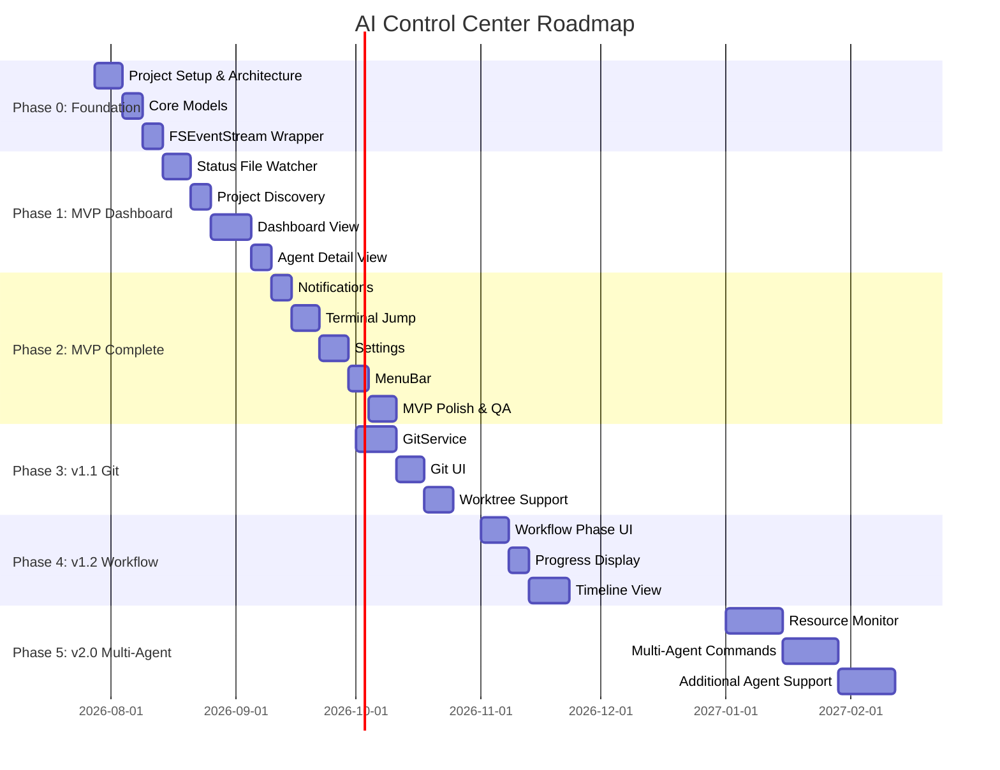

# Roadmap

AI Control Center の詳細ロードマップ。Phase / Epic / Story / Task 単位で管理。

---

## 全体フェーズ

---

## Phase 0: Foundation

**目標**: プロジェクトの土台を作る。コードが動く状態にする。  
**完了条件**: Xcode でビルドが通り、空のウィンドウが表示される。

### Epic 0.1: Project Setup

| Story | 詳細 |
|-------|------|
| S0.1.1 Xcode プロジェクト作成 | SwiftUI App テンプレート、Bundle ID 設定、Deployment Target: macOS 14 |
| S0.1.2 ディレクトリ構造の作成 | `App/`, `Dashboard/`, `Detail/`, `Settings/`, `MenuBar/`, `Core/` を作成 |
| S0.1.3 Git リポジトリ初期化 | `.gitignore` (Xcode 用)、初回コミット |
| S0.1.4 テストターゲット設定 | Unit Test ターゲット + UI Test ターゲット追加 |

### Epic 0.2: Core Models

`data-model.md` に定義した全モデルを実装する。

| Story | 詳細 |
|-------|------|
| S0.2.1 AgentStatus enum | rawValue, Color, displayName, priority |
| S0.2.2 AgentType enum | rawValue, displayName, iconName, accentColor |
| S0.2.3 WorkflowPhase enum | rawValue, displayName, iconName |
| S0.2.4 Agent struct | 全プロパティ、computed プロパティ |
| S0.2.5 Project struct | 全プロパティ、computed プロパティ |
| S0.2.6 Activity struct | 全プロパティ |
| S0.2.7 GitStatus struct | 全プロパティ、computed プロパティ |
| S0.2.8 Settings struct | 全プロパティ、UserDefaults 永続化 |
| S0.2.9 AppError enum | 全エラーケース |
| S0.2.10 AgentStatusFile struct | Codable 実装、JSONDecoder 設定 |
| S0.2.11 AppNotification / NotificationLevel | 全プロパティ |
| S0.2.12 TerminalProviderType enum | rawValue, displayName, bundleIdentifier |

### Epic 0.3: Infrastructure

| Story | 詳細 |
|-------|------|
| S0.3.1 FSEventStreamWrapper | FSEventStream を AsyncStream にブリッジ |
| S0.3.2 ProcessRunner | `Process` の async/await ラッパー |
| S0.3.3 Mock データ | 全モデルの Mock ファクトリ（Preview・テスト用） |

---

## Phase 1: MVP Dashboard（コア機能）

**目標**: `.ai/agent-status.json` を監視してリアルタイムに Dashboard へ表示する。  
**完了条件**: ファイルを手動更新すると Dashboard の表示が変わる。

### Epic 1.1: FileWatcher

| Story | 詳細 |
|-------|------|
| S1.1.1 FileWatcherService | watch/unwatch、AsyncStream<FileChangeEvent> |
| S1.1.2 StatusParserService | JSON decode、AgentStatusFile → Agent 変換 |
| S1.1.3 FileWatcher テスト | 一時ファイル書き込みで変更検知を確認 |

### Epic 1.2: Project Discovery

| Story | 詳細 |
|-------|------|
| S1.2.1 ProjectScannerService | scan(root:depth:excludes:) |
| S1.2.2 除外ロジック | excludedNames によるフィルタリング |
| S1.2.3 動的検出 | Root ディレクトリ監視→新規 `.ai/` 検出 |
| S1.2.4 プロジェクト名決定 | ディレクトリ名からの自動生成 |
| S1.2.5 Discovery テスト | 一時ディレクトリを使った統合テスト |

### Epic 1.3: AppState

| Story | 詳細 |
|-------|------|
| S1.3.1 AppState 実装 | @Observable、projects、settings、pendingNotifications |
| S1.3.2 起動フロー | startMonitoring()、structured concurrency |
| S1.3.3 状態更新ロジック | upsertProject、updateAgentStatus、appendActivity |
| S1.3.4 AppState テスト | Mock サービスを使った状態変化テスト |

### Epic 1.4: Dashboard View

| Story | 詳細 |
|-------|------|
| S1.4.1 DashboardViewModel | projects: [Project]、sortOrder、filterStatus |
| S1.4.2 DashboardView 骨格 | List、NavigationSplitView |
| S1.4.3 AgentRowView | カラム表示、カラーコーディング |
| S1.4.4 StatusBadgeView | ステータスドット + テキスト |
| S1.4.5 ElapsedTimeView | リアルタイム経過時間（1秒更新） |
| S1.4.6 フィルター機能 | StatusGroup でフィルタリング |
| S1.4.7 ソート機能 | Status Priority / 名前 / 更新日時 |
| S1.4.8 空状態 | No Projects Found UI |
| S1.4.9 Dashboard Preview | Mock データを使った全状態 Preview |

### Epic 1.5: Agent Detail View

| Story | 詳細 |
|-------|------|
| S1.5.1 AgentDetailViewModel | activities、elapsedTime、workflowPhase |
| S1.5.2 AgentDetailView 骨格 | Inspector Panel または Sheet |
| S1.5.3 ヘッダー部 | エージェント情報、ステータス、経過時間 |
| S1.5.4 ActivityTimelineView | 時系列リスト、カラードット |
| S1.5.5 空状態 | Activity なし表示 |
| S1.5.6 Detail Preview | Mock データを使った Preview |

---

## Phase 2: MVP Complete（通知・ターミナル・設定）

**目標**: 実際に使える状態にする。  
**完了条件**: 通知が届き、ターミナルにジャンプでき、設定が保存される。

### Epic 2.1: Notifications

| Story | 詳細 |
|-------|------|
| S2.1.1 NotificationService | handleTransition、requestAuthorization |
| S2.1.2 NotificationRule | shouldNotify 純粋関数 |
| S2.1.3 クールダウン実装 | 60秒以内の重複通知抑制 |
| S2.1.4 バッチング実装 | 3秒以内の複数 completed をまとめ通知 |
| S2.1.5 通知アクション実装 | UNNotificationAction、Open Dashboard / Jump to Terminal |
| S2.1.6 通知テスト | NotificationRule のユニットテスト |

### Epic 2.2: Terminal Integration

| Story | 詳細 |
|-------|------|
| S2.2.1 TerminalProvider プロトコル | 定義 |
| S2.2.2 TerminalRegistry | 登録・検索 |
| S2.2.3 TerminalService | activate、availableProviders |
| S2.2.4 Terminal.app 実装 | AppleScript ベース |
| S2.2.5 iTerm2 実装 | AppleScript ベース |
| S2.2.6 Ghostty 実装 | URL スキームまたは AppleScript |
| S2.2.7 Automation 権限エラー処理 | 拒否時のダイアログ + System Settings 誘導 |
| S2.2.8 Dashboard の Jump ボタン | ダブルクリック・ボタン実装 |

### Epic 2.3: Settings

| Story | 詳細 |
|-------|------|
| S2.3.1 SettingsViewModel | watchedRootURLs、preferredTerminal、notificationsEnabled |
| S2.3.2 Settings ウィンドウ | タブ付きウィンドウ |
| S2.3.3 General タブ | ディレクトリ追加・削除、scanDepth |
| S2.3.4 NSOpenPanel 統合 | ディレクトリ選択 |
| S2.3.5 Notifications タブ | 通知設定 UI |
| S2.3.6 Terminal タブ | ターミナル選択、Test Jump |
| S2.3.7 Advanced タブ | Activity Retention、Git 設定 |
| S2.3.8 UserDefaults 永続化 | Settings の保存・復元 |

### Epic 2.4: MenuBar

| Story | 詳細 |
|-------|------|
| S2.4.1 NSStatusItem セットアップ | アイコン、ポップオーバー |
| S2.4.2 MenuBarViewModel | 最大 10 件のエージェント一覧 |
| S2.4.3 MenuBarView | プロジェクト行 + バッジ |
| S2.4.4 バッジ状態 | 注意必要（赤）・アクティブ（青）・クリーン（なし） |
| S2.4.5 Dashboard オープン | MenuBar からウィンドウ表示 |

### Epic 2.5: MVP QA

| Story | 詳細 |
|-------|------|
| S2.5.1 E2E テスト計画 | 手動テストマトリクス作成 |
| S2.5.2 メモリリーク確認 | Instruments Leaks で確認 |
| S2.5.3 ダークモード確認 | 全画面のダークモード動作確認 |
| S2.5.4 アクセシビリティ確認 | VoiceOver での基本操作確認 |
| S2.5.5 パフォーマンス確認 | 20プロジェクト同時監視での CPU・メモリ計測 |

---

## Phase 3: v1.1 — Git Integration

**目標**: Git の状態を Dashboard に表示する。  
**完了条件**: ブランチ、Ahead/Behind がリアルタイムで表示される。

### Epic 3.1: GitService

| Story | 詳細 |
|-------|------|
| S3.1.1 GitService 実装 | ProcessRunner で git コマンド実行 |
| S3.1.2 git status parser | `git status --porcelain=v2` のパース |
| S3.1.3 git branch parser | 現在ブランチ取得 |
| S3.1.4 ahead/behind 取得 | `git rev-list --count` |
| S3.1.5 ポーリングループ | Settings.gitPollInterval 間隔で更新 |
| S3.1.6 非 Git リポジトリ対応 | 検出失敗時の graceful handling |

### Epic 3.2: Git UI

| Story | 詳細 |
|-------|------|
| S3.2.1 Dashboard にブランチ表示 | 現在ブランチを Branch カラムに |
| S3.2.2 Ahead/Behind バッジ | ↑3 ↓1 の表示 |
| S3.2.3 Git Detail Sheet | 変更ファイル一覧、stash 数 |
| S3.2.4 コンテキストメニュー | Open in Finder、Show in GitHub |

### Epic 3.3: Worktree

| Story | 詳細 |
|-------|------|
| S3.3.1 Worktree 検出 | `git worktree list` のパース |
| S3.3.2 Worktree の Dashboard 表示 | "(WT)" フラグ、グルーピング |
| S3.3.3 Worktree の Detail 表示 | メインツリーとの関係表示 |

---

## Phase 4: v1.2 — Workflow & Progress

**目標**: 開発フェーズと進捗を可視化する。  
**完了条件**: Workflow Phase バーと Progress インジケーターが表示される。

### Epic 4.1: Workflow Phase UI

| Story | 詳細 |
|-------|------|
| S4.1.1 WorkflowPhaseView | フェーズバー（Spec→Plan→Coding→Review→Test→Done） |
| S4.1.2 現在フェーズのハイライト | `▶` マーカー + 色 |
| S4.1.3 Dashboard への組み込み | Agent Detail の Workflow セクション |

### Epic 4.2: Progress Display

| Story | 詳細 |
|-------|------|
| S4.2.1 ProgressBar コンポーネント | `████████░░ 80%` スタイル |
| S4.2.2 Dashboard 行への組み込み | 小さな ProgressView |
| S4.2.3 Detail への組み込み | 大きな ProgressBar + パーセント |

### Epic 4.3: Timeline View

| Story | 詳細 |
|-------|------|
| S4.3.1 Timeline データ構造 | 全プロジェクトのアクティビティを時系列ソート |
| S4.3.2 TimelineView 実装 | 時系列 Canvas ビュー |
| S4.3.3 フィルタリング | プロジェクト・ステータスでフィルタ |

---

## Phase 5: v2.0 — Multi-Agent & Resource

**目標**: AI エージェントを「管理」できるようにする。  
**完了条件**: CPU 表示とブロードキャストコマンドが動作する。

### Epic 5.1: Resource Monitor

| Story | 詳細 |
|-------|------|
| S5.1.1 プロセス追跡 | `ps` / `proc_info` でエージェントプロセスを特定 |
| S5.1.2 CPU/Memory 取得 | リアルタイム更新 |
| S5.1.3 Resource UI | Dashboard 行への CPU/Memory カラム追加 |

### Epic 5.2: Multi-Agent Commands

| Story | 詳細 |
|-------|------|
| S5.2.1 コマンドプロトコル | AgentCommand プロトコル定義 |
| S5.2.2 Stop All 実装 | 全エージェントへの停止シグナル |
| S5.2.3 コマンド UI | ツールバーのブロードキャストボタン |

### Epic 5.3: Additional Agents

| Story | 詳細 |
|-------|------|
| S5.3.1 Cursor Agent 対応 | agent-status.json フォーマットの確認・対応 |
| S5.3.2 OpenAI CLI 対応 | 同上 |
| S5.3.3 Claude Code Hook 統合 | `.claude/settings.json` の hooks で自動書き込み |

---

## バージョンサマリー

| バージョン | リリース目標 | 主要機能 |
|-----------|------------|---------|
| MVP (v0.9) | 2026年9月 | Dashboard、通知、ターミナルジャンプ、設定、MenuBar |
| v1.0 | 2026年9月末 | App Sandbox 対応、Warp 対応、QA 完了 |
| v1.1 | 2026年10月 | Git Integration、Worktree |
| v1.2 | 2026年11月 | Workflow、Progress、Timeline |
| v2.0 | 2027年1月 | Resource Monitor、Multi-Agent Commands、追加エージェント |
