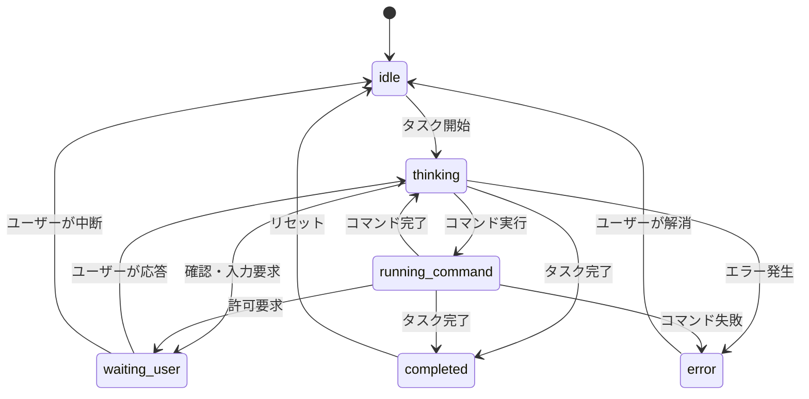

# Status Contract

`agent-status.json` の正式仕様書。

AI Control Center と各 AI エージェントの間の **唯一の契約**。  
エージェントはこのファイルに書く。AI Control Center はこのファイルを読む。それだけ。

---

## 設計原則

1. **疎結合**: AI Control Center はターミナル出力を解析しない。このファイルだけを見る
2. **後方互換性**: 既存フィールドの削除・リネームは行わない
3. **フォールバック**: 未知フィールド・未知 enum 値はスキップ。アプリをクラッシュさせない
4. **最小限の必須フィールド**: `schema_version`、`agent`、`status`、`updated_at` だけあれば動く

---

## ファイルパス

```
{project_root}/.ai/agent-status.json
```

- `.ai/` ディレクトリはプロジェクトルートに配置する
- `agent-status.json` は固定ファイル名（将来的にエージェント別に拡張予定）
- `.ai/` を `.gitignore` に追加することを推奨（ただし必須ではない）

---

## JSON Schema (v1.0)

```json
{
  "$schema": "https://json-schema.org/draft/2020-12/schema",
  "$id": "https://ai-control-center/schemas/agent-status/v1.0.json",
  "title": "AgentStatus",
  "description": "AI Control Center が読み込む AI エージェントのステータスファイル",
  "type": "object",
  "required": ["schema_version", "agent", "status", "updated_at"],
  "additionalProperties": true,
  "properties": {
    "schema_version": {
      "type": "string",
      "description": "スキーマバージョン。SemVer 形式",
      "pattern": "^\\d+\\.\\d+$",
      "examples": ["1.0"]
    },
    "agent": {
      "type": "string",
      "description": "エージェント識別子",
      "enum": [
        "claude-code",
        "cursor",
        "openai-codex",
        "gemini-cli",
        "aider",
        "unknown"
      ]
    },
    "status": {
      "type": "string",
      "description": "エージェントの現在の状態",
      "enum": [
        "idle",
        "thinking",
        "running_command",
        "waiting_user",
        "completed",
        "error"
      ]
    },
    "task": {
      "type": "string",
      "description": "現在実行中のタスクの人間可読な説明。最大 200 文字",
      "maxLength": 200,
      "examples": ["Refactoring AuthService to use JWT"]
    },
    "workflow_phase": {
      "type": "string",
      "description": "開発フェーズ",
      "enum": [
        "spec",
        "planning",
        "coding",
        "review",
        "testing",
        "debugging",
        "deploying"
      ]
    },
    "progress": {
      "type": "number",
      "description": "0.0〜1.0 の進捗。未知の場合は省略",
      "minimum": 0.0,
      "maximum": 1.0,
      "examples": [0.65]
    },
    "branch": {
      "type": "string",
      "description": "現在の Git ブランチ名",
      "examples": ["feature/auth-refactor"]
    },
    "worktree": {
      "type": "string",
      "description": "Worktree を使用している場合の絶対パス",
      "examples": ["/Users/user/projects/clinic"]
    },
    "started_at": {
      "type": "string",
      "description": "タスク開始日時。ISO 8601 UTC",
      "format": "date-time",
      "examples": ["2026-07-28T09:00:00Z"]
    },
    "updated_at": {
      "type": "string",
      "description": "このファイルが最後に更新された日時。ISO 8601 UTC",
      "format": "date-time",
      "examples": ["2026-07-28T09:42:17Z"]
    },
    "error_message": {
      "type": "string",
      "description": "status が error のとき、エラー内容を記述。最大 500 文字",
      "maxLength": 500
    },
    "metadata": {
      "type": "object",
      "description": "エージェント固有の追加情報。AI Control Center は無視するが、将来の拡張のために保持される",
      "additionalProperties": {
        "type": "string"
      },
      "examples": [{"session_id": "abc123", "model": "claude-opus-5"}]
    }
  }
}
```

---

## Status 一覧

| 値 | 意味 | 遷移元 | 遷移先 |
|-----|------|--------|--------|
| `idle` | 待機中。入力待ちでもなく、処理中でもない | `completed`, `error`, `waiting_user` (拒否後) | `thinking` |
| `thinking` | LLM が応答を生成中 | `idle`, `running_command` | `running_command`, `waiting_user`, `completed`, `error` |
| `running_command` | シェルコマンドを実行中 | `thinking` | `thinking`, `waiting_user`, `completed`, `error` |
| `waiting_user` | ユーザーの入力・承認を待っている | `thinking`, `running_command` | `thinking`, `idle` |
| `completed` | タスクが正常に完了した | `thinking`, `running_command` | `idle` |
| `error` | エラーが発生し、処理が停止した | `thinking`, `running_command` | `idle` (ユーザーが解消後) |

### 状態遷移図



---

## workflow_phase 一覧

| 値 | 意味 | 典型的な status |
|----|------|----------------|
| `spec` | 仕様の確認・整理 | `thinking` |
| `planning` | 実装計画の立案 | `thinking` |
| `coding` | コード実装 | `thinking`, `running_command` |
| `review` | コードレビュー | `thinking` |
| `testing` | テスト実行・修正 | `running_command`, `thinking` |
| `debugging` | バグ調査・修正 | `thinking`, `running_command` |
| `deploying` | デプロイ作業 | `running_command` |

---

## バージョニング

### バージョン形式

`MAJOR.MINOR` 形式（例: `"1.0"`、`"1.1"`、`"2.0"`）

| バージョンアップ条件 | 種別 |
|---------------------|------|
| 必須フィールドの追加 / 既存フィールドの型変更 / フィールド削除 | MAJOR |
| オプションフィールドの追加 | MINOR |

### AI Control Center の互換性ポリシー

| ファイルのバージョン | 動作 |
|--------------------|------|
| 同じ MAJOR (`1.x`) | フル対応 |
| 未知のフィールドを含む | スキップして処理継続 |
| 未知の MAJOR | 警告表示、読み込み試行 |
| `schema_version` なし | フォールバック: `"1.0"` として扱う |

---

## 更新タイミングと更新ルール

### エージェントが書き込むべきタイミング

1. **状態が変化するたびに** → `status` フィールドと `updated_at` を必ず更新
2. **タスクが変化するたびに** → `task` フィールドを更新
3. **フェーズが変化するたびに** → `workflow_phase` を更新
4. **進捗が変化するたびに** → `progress` を更新（頻繁すぎる更新は不要。5%単位など）
5. **エラー発生時** → `status: "error"` + `error_message` を設定
6. **タスク完了時** → `status: "completed"` を設定、`progress: 1.0` を推奨

### 書き込みルール

- **アトミック書き込み**: 一時ファイルに書き込んでからリネームする（部分書き込みを防ぐ）
  ```
  1. .ai/agent-status.json.tmp に書き込む
  2. rename(.tmp → agent-status.json)
  ```
- **UTF-8 エンコード** を使用
- **JSON の整形**: 人間が読めるよう 2スペースインデントを推奨（必須ではない）
- **日時**: 必ず UTC の ISO 8601 形式（`2026-07-28T09:42:17Z`）
- **ファイルが存在しない場合**: AI Control Center はプロジェクトを「非アクティブ」として扱う

### Claude Code での実装例（フック）

```bash
# .claude/settings.json の hooks で実現する場合
# PreToolUse → status: "running_command"
# PostToolUse → status: "thinking"
# Stop → status: "completed" or "waiting_user"
```

---

## サンプル JSON

### 最小限（必須フィールドのみ）

```json
{
  "schema_version": "1.0",
  "agent": "claude-code",
  "status": "thinking",
  "updated_at": "2026-07-28T09:42:17Z"
}
```

---

### 標準的な Thinking 状態

```json
{
  "schema_version": "1.0",
  "agent": "claude-code",
  "status": "thinking",
  "task": "Refactoring AuthService to use JWT",
  "workflow_phase": "coding",
  "progress": 0.65,
  "branch": "feature/auth-jwt",
  "started_at": "2026-07-28T09:00:00Z",
  "updated_at": "2026-07-28T09:42:17Z"
}
```

---

### コマンド実行中

```json
{
  "schema_version": "1.0",
  "agent": "claude-code",
  "status": "running_command",
  "task": "Running test suite",
  "workflow_phase": "testing",
  "progress": 0.80,
  "branch": "feature/auth-jwt",
  "started_at": "2026-07-28T09:00:00Z",
  "updated_at": "2026-07-28T09:55:00Z",
  "metadata": {
    "command": "swift test"
  }
}
```

---

### ユーザー入力待ち

```json
{
  "schema_version": "1.0",
  "agent": "claude-code",
  "status": "waiting_user",
  "task": "Permission required: write to /etc/hosts",
  "workflow_phase": "deploying",
  "branch": "main",
  "started_at": "2026-07-28T10:00:00Z",
  "updated_at": "2026-07-28T10:05:33Z"
}
```

---

### エラー状態

```json
{
  "schema_version": "1.0",
  "agent": "claude-code",
  "status": "error",
  "task": "Build failed",
  "workflow_phase": "coding",
  "branch": "feature/auth-jwt",
  "error_message": "Compilation error: Cannot find type 'JWTService' in scope (AuthViewModel.swift:42)",
  "started_at": "2026-07-28T09:00:00Z",
  "updated_at": "2026-07-28T10:12:00Z"
}
```

---

### 完了状態

```json
{
  "schema_version": "1.0",
  "agent": "claude-code",
  "status": "completed",
  "task": "Auth refactor complete. All tests passing.",
  "workflow_phase": "testing",
  "progress": 1.0,
  "branch": "feature/auth-jwt",
  "started_at": "2026-07-28T09:00:00Z",
  "updated_at": "2026-07-28T11:30:00Z"
}
```

---

### Worktree を使用した場合

```json
{
  "schema_version": "1.0",
  "agent": "claude-code",
  "status": "coding",
  "task": "Implementing payment flow",
  "workflow_phase": "coding",
  "progress": 0.3,
  "branch": "feature/payment",
  "worktree": "/Users/user/projects/clinic-payment-worktree",
  "started_at": "2026-07-28T08:00:00Z",
  "updated_at": "2026-07-28T08:45:00Z"
}
```

---

### metadata を使ったエージェント固有情報

```json
{
  "schema_version": "1.0",
  "agent": "claude-code",
  "status": "thinking",
  "task": "Analyzing codebase",
  "branch": "main",
  "updated_at": "2026-07-28T09:00:00Z",
  "metadata": {
    "model": "claude-opus-5",
    "session_id": "session_abc123xyz",
    "tokens_used": "45230"
  }
}
```

---

## 将来追加予定のフィールド（v1.1+）

以下は現バージョンでは無視されるが、将来のマイナーバージョンアップで正式対応する予定のフィールド。

| フィールド | 型 | 説明 |
|-----------|------|------|
| `sub_tasks` | `array` | 進行中のサブタスク一覧 |
| `file_paths` | `array` | 現在編集中のファイルパス |
| `estimated_completion` | `string` | 完了予測日時（ISO 8601） |
| `token_count` | `number` | 消費トークン数 |
| `cost_usd` | `number` | 推定コスト（USD） |
| `context_window_usage` | `number` | 0.0〜1.0 のコンテキスト使用率 |
| `agent_version` | `string` | エージェントのバージョン |
