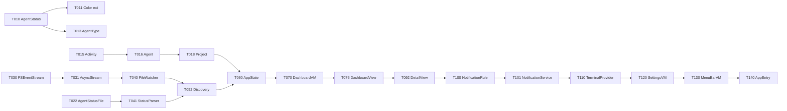

# Tasks

Claude Code が実装できる粒度まで分解したタスク一覧。

各タスクは単一のファイル作成・編集で完了できるサイズを目安にしている。  
実装順序は依存関係に従う（上から順に実装すること）。

---

## Phase 0: Foundation

### Epic 0.1: Project Setup

#### Story S0.1.1 — Xcode プロジェクト作成

- [ ] **T001** Xcode で `AIControlCenter` という名前の macOS SwiftUI App プロジェクトを作成
  - Bundle ID: `jp.daxe.ai-control-center`（または任意）
  - Deployment Target: macOS 14.0
  - Language: Swift
  - Interface: SwiftUI
  - Include Tests: Yes（Unit Test + UI Test）
  - Storage: None

- [ ] **T002** `.gitignore` を Xcode 用に作成
  - Xcode、Swift、macOS の標準 ignore パターンを含める
  - `.ai/` ディレクトリもリポジトリに含めない場合は追加

- [ ] **T003** ディレクトリ構造を作成（`architecture.md` 参照）
  - `AIControlCenter/App/`
  - `AIControlCenter/Dashboard/`
  - `AIControlCenter/Detail/`
  - `AIControlCenter/Settings/`
  - `AIControlCenter/MenuBar/`
  - `AIControlCenter/Core/State/`
  - `AIControlCenter/Core/Models/`
  - `AIControlCenter/Core/Services/`
  - `AIControlCenter/Core/Infrastructure/`
  - `AIControlCenter/Core/Extensions/`
  - `AIControlCenter/Resources/`
  - `AIControlCenterTests/`
  - `AIControlCenterUITests/`

---

### Epic 0.2: Core Models

> **実装前提**: `data-model.md` を必ず参照すること。

#### Story S0.2.1 — AgentStatus

- [ ] **T010** `Core/Models/AgentStatus.swift` を作成
  - `enum AgentStatus: String, Codable, Sendable, CaseIterable`
  - ケース: `idle`, `thinking`, `runningCommand`, `waitingUser`, `completed`, `error`
  - raw value: snake_case（例: `running_command`）
  - `var displayName: String` computed property
  - `var priority: Int` computed property（通知優先度。`data-model.md` の表を参照）

- [ ] **T011** `Core/Extensions/Color+AgentStatus.swift` を作成
  - `AgentStatus` に `var color: Color` extension を追加
  - システムカラーのみ使用（`.blue`, `.yellow`, `.orange`, `.green`, `.red`, `.secondary`）
  - ダークモード対応は自動（システムカラーのため）

- [ ] **T012** `AgentStatusTests.swift` を作成
  - 全ケースの `rawValue` 変換テスト
  - JSON encode/decode ラウンドトリップテスト
  - `priority` の大小関係テスト（error > waitingUser > runningCommand）

#### Story S0.2.2 — AgentType

- [ ] **T013** `Core/Models/AgentType.swift` を作成
  - `enum AgentType: String, Codable, Sendable, CaseIterable`
  - ケース: `claudeCode`, `cursor`, `openaiCodex`, `geminiCLI`, `aider`, `unknown`
  - raw value: `"claude-code"`, `"cursor"`, etc.
  - `var displayName: String`
  - `var iconSystemName: String`（SF Symbols 名）
  - `unknown` へのフォールバック: `init(rawValue:)` が未知の場合 `.unknown` を返すカスタムイニシャライザ

#### Story S0.2.3 — WorkflowPhase

- [ ] **T014** `Core/Models/WorkflowPhase.swift` を作成
  - `enum WorkflowPhase: String, Codable, Sendable, CaseIterable`
  - ケース: `spec`, `planning`, `coding`, `review`, `testing`, `debugging`, `deploying`
  - `var displayName: String`
  - `var iconSystemName: String`
  - `var ordinal: Int`（フェーズの順番、Workflow バーでの並び順）

#### Story S0.2.4 — Activity

- [ ] **T015** `Core/Models/Activity.swift` を作成
  - `struct Activity: Identifiable, Sendable, Hashable`
  - 全プロパティを `data-model.md` に従って定義
  - `var formattedTimestamp: String`（HH:mm 形式、昨日以前は MM/dd HH:mm）
  - **【注意】格納順序**: `activities` は古い順（追記順）で保持。UI では `.reversed()` で表示する

#### Story S0.2.5 — Agent

- [ ] **T016** `Core/Models/Agent.swift` を作成
  - `struct Agent: Identifiable, Sendable, Hashable`
  - 全プロパティを `data-model.md` に従って定義
  - `var previousStatus: AgentStatus?`（`activities.last?.status` — 末尾が最新）
  - `var elapsedSinceLastChange: TimeInterval`
  - `var needsAttention: Bool`（`status == .waitingUser || status == .error`）
  - `mutating func appendActivity(_ activity: Activity)`（末尾 append、最大 200件 — 超過時は `removeFirst()`）
  - **【注意】** `activities[0]` が最古、`activities.last` が最新。UI で逆順表示すること

#### Story S0.2.6 — GitStatus

- [ ] **T017** `Core/Models/GitStatus.swift` を作成
  - `struct GitStatus: Sendable, Hashable`
  - 全プロパティを `data-model.md` に従って定義
  - `var isClean: Bool`
  - `var totalChanges: Int`
  - `enum SyncStatus` と `var syncStatus: SyncStatus`

#### Story S0.2.7 — Project

- [ ] **T018** `Core/Models/Project.swift` を作成
  - `struct Project: Identifiable, Sendable, Hashable`
  - 全プロパティを `data-model.md` に従って定義
  - `var statusFileURL: URL`（`rootURL.appendingPathComponent(".ai/agent-status.json")` から導出）
  - `var primaryAgent: Agent?`
  - `var aggregatedStatus: AgentStatus`（エージェント中の最高優先度ステータス）

#### Story S0.2.8 — Settings

- [ ] **T019** `Core/Models/Settings.swift` を作成
  - `struct Settings: Sendable`
  - 全プロパティを `data-model.md` に従って定義
  - `UserDefaults` からの read/write は Settings 内には含めない（SettingsStore が担当）

- [ ] **T020** `Core/Models/SettingsStore.swift` を作成
  - `@Observable final class SettingsStore`（または UserDefaults wrapper）
  - `Settings` を `UserDefaults` に encode して保存
  - URL の保存は `bookmark data` 形式（MVP では absoluteString で簡略化可）
  - `func save(_ settings: Settings)`
  - `func load() -> Settings`

#### Story S0.2.9 — AppError

- [ ] **T021** `Core/Models/AppError.swift` を作成
  - `enum AppError: Error, Sendable`
  - 全ケースを `architecture.md` に従って定義
  - `var localizedDescription: String`（ユーザーに表示するメッセージ）
  - `var recoverySuggestion: String?`

#### Story S0.2.10 — AgentStatusFile（Codable）

- [ ] **T022** `Core/Models/AgentStatusFile.swift` を作成
  - `struct AgentStatusFile: Decodable, Sendable`
  - 全プロパティを `data-model.md` に従って定義（`status-contract.md` の JSON キーと一致させること）
  - `CodingKeys` で snake_case → camelCase 変換
  - `decoder.dateDecodingStrategy = .iso8601` を使用
  - `unknownField` は `additionalProperties` パターンで無視（デフォルト動作）

- [ ] **T023** `AgentStatusFileTests.swift` を作成
  - `status-contract.md` のサンプル JSON 全件をテスト
  - 未知フィールドを含む JSON のデコードテスト（クラッシュしないこと）
  - `schema_version` なしの JSON のデコードテスト

#### Story S0.2.11 — AppNotification・NotificationLevel

- [ ] **T024** `Core/Models/AppNotification.swift` を作成
  - `struct AppNotification: Identifiable, Sendable`
  - `enum NotificationLevel: Int, Comparable, Sendable, CaseIterable`
  - `struct StatusTransition: Sendable`

#### Story S0.2.12 — TerminalProviderType

- [ ] **T025** `Core/Models/TerminalProviderType.swift` を作成
  - `enum TerminalProviderType: String, Codable, Sendable, CaseIterable`
  - `var displayName: String`
  - `var bundleIdentifier: String`

---

### Epic 0.3: Infrastructure

#### Story S0.3.1 — FSEventStreamWrapper

- [ ] **T030** `Core/Infrastructure/FSEventStreamWrapper.swift` を作成
  - `final class FSEventStreamWrapper: @unchecked Sendable`
  - `func startWatching(urls: [URL], callback: @escaping (FSEventStreamWrapper.Event) -> Void) -> Bool`
  - `func stopWatching()`
  - `struct Event: Sendable { url: URL, flags: FSEventStreamEventFlags, eventID: FSEventStreamEventId }`
  - `latency: CFTimeInterval = 0.5`（変更後 0.5秒でコールバック。必要なら調整）
  - `flags: FSEventStreamCreateFlags = [.useCFTypes, .fileEvents, .watchRoot]`
  - **【追加】Stage 1 フィルタリング**: コールバック内でパスセグメントに除外名が含まれる場合は即 return
    - 除外セグメントは `Set<String>` として値コピーして渡す（`@Sendable` クロージャ内でのアクセスを安全にする）
  - **【追加】Stage 2 フィルタリング**: `lastPathComponent != "agent-status.json"` なら即 return
    - `.tmp`, `.swp` など一時ファイルのイベントをここで破棄
    - `kFSEventStreamEventFlagItemIsDir` フラグが立っている場合も破棄

- [ ] **T031** `Core/Infrastructure/AsyncFSEventStream.swift` を作成
  - `FSEventStreamWrapper` を `AsyncStream<FSEventStreamWrapper.Event>` にブリッジ
  - `func makeEventStream(for urls: [URL]) -> AsyncStream<FSEventStreamWrapper.Event>`
  - `AsyncStream.Continuation` を使って `FSEventStreamWrapper` のコールバックをブリッジ

#### Story S0.3.2 — ProcessRunner

- [ ] **T032** `Core/Infrastructure/ProcessRunner.swift` を作成
  - `struct ProcessResult: Sendable { stdout: String, stderr: String, exitCode: Int32 }`
  - `func run(_ command: String, arguments: [String], workingDirectory: URL?) async throws -> ProcessResult`
  - タイムアウト: デフォルト 10秒
  - `Process`, `Pipe` を使用（外部ライブラリ不要）

#### Story S0.3.3 — Mock データ

- [ ] **T033** `Core/Models/MockData.swift` を作成
  - `enum MockData`（namespace として使用）
  - `static let projects: [Project]`（5件。各 AgentStatus を網羅）
  - `static let agents: [Agent]`
  - `static let activities: [Activity]`（10件/エージェント）
  - `static let settings: Settings`
  - `static func project(status: AgentStatus) -> Project`

---

## Phase 1: MVP Dashboard

### Epic 1.1: FileWatcher

#### Story S1.1.1 — FileWatcherService

- [ ] **T040** `Core/Services/FileWatcherService.swift` を作成
  - `final class FileWatcherService: @unchecked Sendable`
  - `func watch(url: URL) -> AsyncStream<FileChangeEvent>`
  - `func unwatch(url: URL)`
  - `struct FileChangeEvent: Sendable { url: URL, timestamp: Date }`
  - 内部で `AsyncFSEventStream` を使用
  - 同一 URL の重複登録を防ぐ（`Set<URL>` で管理）

#### Story S1.1.2 — StatusParserService

- [ ] **T041** `Core/Services/StatusParserService.swift` を作成
  - `struct StatusParserService: Sendable`
  - `func parse(url: URL) async throws -> AgentStatusFile`
  - `func toAgent(from file: AgentStatusFile, projectID: UUID, existing: Agent?) -> Agent`
    - `existing` が渡された場合は `activities` を引き継ぎ、差分のみ更新
    - 未知の `status` 文字列は `AgentType.unknown` / `AgentStatus.idle` にフォールバック

- [ ] **T042** `StatusParserServiceTests.swift` を作成
  - `status-contract.md` の全サンプル JSON でパーステスト
  - 未知フィールドの無視テスト
  - 未知ステータス値のフォールバックテスト

#### Story S1.1.3 — FileWatcherService テスト

- [ ] **T043** `FileWatcherServiceTests.swift` を作成
  - `FileManager` で一時ファイルを作成し、変更を検知できることを確認
  - `unwatch` 後はイベントが来ないことを確認
  - 注: 非同期テストのため `async let` または `withCheckedContinuation` を使用

---

### Epic 1.2: Project Discovery

#### Story S1.2.1 — ProjectScannerService

- [ ] **T050** `Core/Services/ProjectScannerService.swift` を作成
  - `final class ProjectScannerService: Sendable`
  - `func scan(rootURL: URL, depth: Int, excludedNames: Set<String>) async -> [Project]`
    - `FileManager.contentsOfDirectory(at:includingPropertiesForKeys:options:)` を使用
    - BFS で走査（`project-discovery.md` のアルゴリズム参照）
    - `.ai/agent-status.json` を見つけたらその親ディレクトリを `Project` として登録
  - `func scanAll(rootURLs: [URL], settings: Settings) async -> [Project]`

- [ ] **T051** `ProjectScannerServiceTests.swift` を作成
  - `FileManager` で一時ディレクトリツリーを作成してテスト
  - 除外ディレクトリのスキップテスト（`node_modules` 等）
  - `scanDepth` 制限のテスト
  - `.ai/` を持つディレクトリ以下を潜らないことのテスト

#### Story S1.2.2 — 動的検出

- [ ] **T052** `Core/Services/ProjectDiscoveryService.swift` を作成
  - `final class ProjectDiscoveryService: @unchecked Sendable`
  - `func startDiscovery(rootURLs: [URL], settings: Settings) -> AsyncStream<DiscoveryEvent>`
    - `scanAll` で初回スキャン
    - `FileWatcherService` で Root ディレクトリを監視
    - 新規 `.ai/agent-status.json` 検出 → `DiscoveryEvent.projectAdded`
    - 削除 → `DiscoveryEvent.projectRemoved`
  - `enum DiscoveryEvent: Sendable { case projectAdded(Project), projectRemoved(UUID), projectUpdated(Project) }`

---

### Epic 1.3: AppState

- [ ] **T060** `Core/State/AppState.swift` を作成
  - `@Observable @MainActor final class AppState`
  - `private(set) var projects: [Project] = []`
  - `private(set) var recentErrors: [AppError] = []`
  - **【追加】** `private(set) var pendingBanners: [BannerMessage] = []`（フォールバック通知などに使用）
  - `var settings: Settings`（SettingsStore から読み込み）
  - `func startMonitoring() async`（Discovery + Watcher のメインループ）
  - `func stopMonitoring()`
  - `func upsertProject(_ project: Project)`
  - `func updateAgentStatus(projectID: UUID, agentStatusFile: AgentStatusFile)`
  - `func removeProject(id: UUID)`
  - `func addError(_ error: AppError)`
  - **【追加】** `func addBanner(_ banner: BannerMessage)` / `func dismissBanner(id: UUID)`
  - `struct BannerMessage: Identifiable, Sendable` — `id, message: String, level: BannerLevel, autoDismissAfter: TimeInterval?`

- [ ] **T061** `AppStateTests.swift` を作成
  - Mock サービスを使って `upsertProject` テスト
  - `updateAgentStatus` で Activity が追加されることのテスト
  - `projects` の `aggregatedStatus` テスト

---

### Epic 1.4: Dashboard View

#### Story S1.4.1 — DashboardViewModel

- [ ] **T070** `Dashboard/DashboardViewModel.swift` を作成
  - `@Observable @MainActor final class DashboardViewModel`
  - `var sortedProjects: [Project]`（AppState の projects を sortOrder でソート）
  - `var filteredProjects: [Project]`（filterStatus でフィルタリング後）
  - **【追加】** `var searchText: String = ""`（インクリメンタルサーチ用）
  - **【追加】** `var displayedProjects: [Project]`（filteredProjects にサーチを適用した最終リスト）
    - `searchText.isEmpty` なら `filteredProjects` をそのまま返す
    - 非空なら `project.name`, `agent.currentTask`, `agent.branch`, `agentType.displayName` で部分一致フィルタ（大文字小文字非区別）
  - `var sortOrder: SortOrder`
  - `var filterStatus: AgentStatus?`
  - `var selectedProjectID: UUID?`
  - `enum SortOrder: String, CaseIterable { case statusPriority, name, lastUpdated, elapsed }`
  - `func jumpToTerminal(project: Project) async`

#### Story S1.4.2 — StatusBadgeView

- [ ] **T071** `Dashboard/StatusBadgeView.swift` を作成
  - `struct StatusBadgeView: View`
  - 引数: `status: AgentStatus`
  - カラーのドット（Circle）+ ステータス名テキスト
  - ドットのサイズ: 8pt
  - アニメーション: `thinking` のときは pulse アニメーション（`@State` + `.animation(.easeInOut.repeatForever())`）

- [ ] **T072** `Dashboard/StatusBadgeViewPreview.swift` を作成（または `#Preview` を同ファイルに）
  - 全 `AgentStatus` ケースを並べた Preview

#### Story S1.4.3 — ElapsedTimeView

- [ ] **T073** `Dashboard/ElapsedTimeView.swift` を作成
  - `struct ElapsedTimeView: View`
  - 引数: `since: Date`
  - `TimelineView(.periodic(from:by:))` または `onAppear` + `Timer` で 1秒更新
  - 表示形式: `0m 45s` / `3m 22s` / `1h 15m`（1時間超は分まで）
  - `since` が nil 相当（Idle の場合）は `—` を表示

#### Story S1.4.4 — AgentRowView

- [ ] **T074** `Dashboard/AgentRowView.swift` を作成
  - `struct AgentRowView: View`
  - 引数: `project: Project`
  - カラム: Project名 / Agent種別アイコン+名前 / StatusBadge / ElapsedTime / Branch / CurrentTask
  - `branch` は `.monospacedDigit()` フォント
  - `currentTask` は `lineLimit(1)` で省略
  - 行高さ: 44pt
  - ホバー時にハイライト（`.onHover` + `@State var isHovered`）

- [ ] **T075** `AgentRowViewPreview.swift` を作成
  - MockData の全ステータスで Preview

#### Story S1.4.5 — DashboardView

- [ ] **T076** `Dashboard/DashboardView.swift` を作成
  - `struct DashboardView: View`
  - `@Environment(AppState.self) var appState`
  - `@State private var viewModel = DashboardViewModel()`
  - `NavigationSplitView` でリストと Detail を分割（サイドバーなし、2カラム）
  - `List` で `AgentRowView` を並べる（`viewModel.displayedProjects` を使用）
  - ツールバー: タイトル、フィルターメニュー、ソートメニュー、設定ボタン
  - **【追加】** ツールバー直下に `SearchBar`（`TextField` ベース）を常時表示
    - `⌘F` でフォーカス（`.focusedValue` または `@FocusState` を使用）
    - `Escape` でクリア＆フォーカス解除
  - `Table` ではなく `List` を使用（カスタム行レイアウトのため）

- [ ] **T077** フィルターメニューを実装
  - `Menu("Filter") { Picker(selection:) { ForEach(StatusGroup) } }` スタイル
  - `filterStatus` が変わると `filteredProjects` が即座に更新

- [ ] **T078** ソートメニューを実装
  - `Menu("Sort") { Picker(selection:) { ForEach(SortOrder) } }` スタイル

- [ ] **T079** 空状態 View を実装
  - `struct EmptyDashboardView: View`
  - 中央にアイコン + メッセージ + Settings を開くボタン
  - `viewModel.filteredProjects.isEmpty` の場合に表示

- [ ] **T080** コンテキストメニューを実装
  - `AgentRowView` に `.contextMenu { ... }` を追加
  - `ui-spec.md` のメニュー項目を実装

- [ ] **T081** キーボードショートカットを実装
  - `⌘R`: 手動リフレッシュ
  - `⌘,`: Settings を開く
  - `↑↓`: 行移動（List のデフォルト動作で対応）
  - `Enter` / `⌘↵`: ターミナルジャンプ

- [ ] **T082** `DashboardViewPreview.swift` を作成
  - Mock データ（5件、全ステータス含む）での Preview
  - ダークモード Preview

---

### Epic 1.5: Agent Detail View

#### Story S1.5.1 — AgentDetailViewModel

- [ ] **T090** `Detail/AgentDetailViewModel.swift` を作成
  - `@Observable @MainActor final class AgentDetailViewModel`
  - 引数: `project: Project`
  - `var activities: [Activity]`（project の primaryAgent から取得）
  - `var elapsedText: String`
  - `var workflowPhase: WorkflowPhase?`
  - `var progress: Double?`

#### Story S1.5.2 — ActivityRowView

- [ ] **T091** `Detail/ActivityRowView.swift` を作成
  - `struct ActivityRowView: View`
  - 引数: `activity: Activity, isLatest: Bool`
  - 左: カラードット + 縦線（タイムライン視覚化）
  - 中: タイムスタンプ + ステータス名 + タスク名
  - 右: duration テキスト（`(3m 12s)`）
  - `isLatest` の場合は `← current` バッジを表示
  - **【注意】** `ForEach` に `.id(activity.id)` を付与して安定 identity を確保（不要な再描画を防ぐ）

#### Story S1.5.3 — AgentDetailView

- [ ] **T092** `Detail/AgentDetailView.swift` を作成
  - `struct AgentDetailView: View`
  - 引数: `project: Project`
  - ヘッダーセクション: エージェント名、プロジェクト名、ブランチ、起動時刻、経過時間
  - Current Task セクション: `project.primaryAgent?.currentTask`
  - Activity セクション: `ScrollView` + `LazyVStack` + `ActivityRowView`
    - **【追加】** `agent.activities.reversed()` で逆順表示（コピーなし O(1)）
    - `ForEach` に `\.id` を明示して差分更新を最小化
  - ツールバーに `Jump to Terminal` ボタン
  - `project` が nil のとき: placeholder 表示

- [ ] **T093** `AgentDetailViewPreview.swift` を作成
  - MockData の各ステータスで Preview

---

## Phase 2: MVP Complete

### Epic 2.1: Notifications

- [ ] **T100** `Core/Services/NotificationRule.swift` を作成
  - `enum NotificationRule`（namespace）
  - `static func shouldNotify(transition: StatusTransition, settings: Settings, recentNotifications: [AppNotification]) -> AppNotification?`
  - 純粋関数（副作用なし → ユニットテスト容易）

- [ ] **T101** `Core/Services/NotificationService.swift` を作成
  - `final class NotificationService: @unchecked Sendable`
  - `func requestAuthorization() async throws -> Bool`
  - `func handleTransition(_ transition: StatusTransition, settings: Settings) async`
  - `func authorizationStatus() async -> UNAuthorizationStatus`
  - 通知アクション（`UNNotificationAction`）の登録: `OpenDashboard`, `JumpToTerminal`
  - `UNUserNotificationCenterDelegate` 準拠（`AppDelegate` に設定）

- [ ] **T102** `NotificationRuleTests.swift` を作成
  - `notification.md` のテストケース全件を実装

### Epic 2.2: Terminal Integration

- [ ] **T110** `Core/Services/Terminal/TerminalProvider.swift` を作成
  - `protocol TerminalProvider` の定義
  - `enum TerminalProviderError: Error` の定義

- [ ] **T111** `Core/Services/Terminal/TerminalRegistry.swift` を作成

- [ ] **T112** `Core/Services/Terminal/TerminalService.swift` を作成

- [ ] **T113** `Core/Services/Terminal/TerminalAppProvider.swift` を作成
  - Terminal.app の AppleScript 実装
  - `supportsFallback = true` を実装（Automation 権限拒否時にフォールバック可能）
  - `Core/Infrastructure/AppleScriptRunner.swift` を先に作成すること

- [ ] **T114** `Core/Infrastructure/AppleScriptRunner.swift` を作成
  - `func run(script: String) async throws -> String`
  - `NSAppleScript` を async でラップ
  - エラーコードが `-1743`（Automation 権限拒否）の場合 `TerminalProviderError.automationPermissionDenied` を throw

- [ ] **T114b** `Core/Services/Terminal/FallbackTerminalJump.swift` を作成 **【追加】**
  - `struct FallbackTerminalJump`
  - `static func execute(workingDirectory: URL, terminalBundleID: String)`
    - `NSPasteboard.general` に `cd '<path>'` コマンドをコピー
    - `NSWorkspace.shared.urlForApplication(withBundleIdentifier:)` でアプリ URL 取得
    - `NSWorkspace.shared.open(appURL)` でターミナルを起動
  - `extension String { var shellEscaped: String }` を同ファイルに追加
    - シングルクォートラップ（スペース・特殊文字を含むパスのエスケープ）

- [ ] **T115** `Core/Services/Terminal/ITerm2Provider.swift` を作成
  - `supportsFallback = true` を実装

- [ ] **T116** `Core/Services/Terminal/GhosttyProvider.swift` を作成

- [ ] **T117** `Dashboard/DashboardView.swift` にターミナルジャンプを接続
  - `AgentRowView` のダブルクリック → `viewModel.jumpToTerminal(project:)` を呼ぶ
  - `automationPermissionDenied` の場合 → `FallbackTerminalJump.execute()` を呼ぶ
  - フォールバック実行後、インラインバナー（`AppState.pendingBanners`）で「cd をコピーした」旨を表示
  - その他エラーは `AppState.addError` へ伝搬して `AlertView` 表示

### Epic 2.3: Settings

- [ ] **T120** `Settings/SettingsViewModel.swift` を作成

- [ ] **T121** `Settings/SettingsView.swift` を作成（TabView ベース）

- [ ] **T122** `Settings/GeneralSettingsView.swift` を作成
  - ディレクトリリスト、追加ボタン（NSOpenPanel）、削除ボタン、スキャン深度ステッパー

- [ ] **T123** `Settings/NotificationSettingsView.swift` を作成

- [ ] **T124** `Settings/TerminalSettingsView.swift` を作成
  - `TerminalRegistry.availableProviders()` を使って利用可能なターミナルを表示
  - 非インストールは `⚠ Not installed` で表示、選択不可

- [ ] **T125** `Settings/AdvancedSettingsView.swift` を作成

- [ ] **T126** Settings ウィンドウを `⌘,` で開けるように `AIControlCenterApp.swift` に接続

### Epic 2.4: MenuBar

- [ ] **T130** `MenuBar/MenuBarViewModel.swift` を作成
  - `var topProjects: [Project]`（最大 10件、優先度順）
  - `var attentionCount: Int`
  - `var badgeState: MenuBarBadgeState`

- [ ] **T131** `MenuBar/MenuBarView.swift` を作成
  - `MenuBarExtra` を使用（macOS 13+）
  - プロジェクト行リスト
  - `Open Dashboard` / `Preferences` / `Quit` メニュー項目

- [ ] **T132** `App/AIControlCenterApp.swift` に MenuBarExtra を接続
  - `MenuBarExtra("AI Control Center", systemImage: "cpu.fill") { MenuBarView() }`

### Epic 2.5: App Entry Point

- [ ] **T140** `App/AIControlCenterApp.swift` を完成させる
  - `@Environment(AppState.self)` の DI セットアップ
  - `WindowGroup` + `Settings` + `MenuBarExtra`
  - `.task { await appState.startMonitoring() }` で監視開始

- [ ] **T141** `App/AppDelegate.swift` を作成
  - `UNUserNotificationCenterDelegate` 準拠
  - 通知アクションのハンドリング（`Jump to Terminal`）

---

## Phase 2.5: QA タスク

- [ ] **T150** 手動テストマトリクスを実行（5プロジェクト、全ステータス）
- [ ] **T151** Instruments でメモリリーク確認
- [ ] **T152** ダークモード全画面確認
- [ ] **T153** VoiceOver 基本動作確認
- [ ] **T154** 20件のプロジェクトでパフォーマンス確認（CPU < 2%、メモリ < 50MB）

---

## タスク依存関係（実装順）

---

## 実装チェックリスト（MVP）

### Foundation
- [ ] T001〜T003 Project Setup
- [ ] T010〜T025 Core Models（12ファイル）
- [ ] T030〜T033 Infrastructure（4ファイル）

### Core Features
- [ ] T040〜T043 FileWatcher（4ファイル）
- [ ] T050〜T052 Project Discovery（3ファイル）
- [ ] T060〜T061 AppState（2ファイル）

### Dashboard
- [ ] T070〜T082 Dashboard（13ファイル）
- [ ] T090〜T093 Agent Detail（4ファイル）

### MVP Complete
- [ ] T100〜T102 Notifications（3ファイル）
- [ ] T110〜T117 Terminal Integration（8ファイル）
- [ ] T120〜T126 Settings（7ファイル）
- [ ] T130〜T132 MenuBar（3ファイル）
- [ ] T140〜T141 App Entry（2ファイル）

### QA
- [ ] T150〜T154 QA

**合計: 約 65 タスク**
