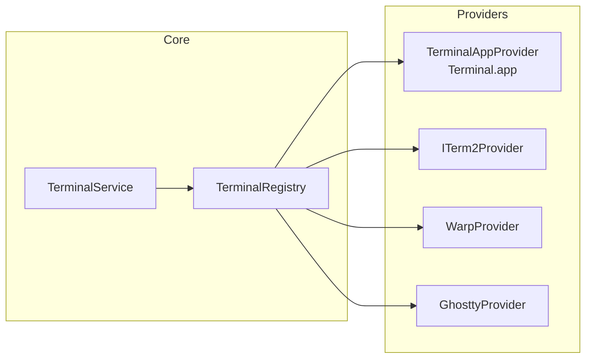

# Terminal Integration

各ターミナルアプリへの遷移（ジャンプ）機能の設計仕様書。

---

## 設計方針

**目的**: エージェントが動作しているターミナルウィンドウに、クリック一発でフォーカスを移動する。

**アプローチ**: `TerminalProvider` プロトコルを定義し、各ターミナルアプリの実装を差し替え可能にする。  
AI Control Center のコアは各ターミナルの実装を知らない。



---

## TerminalProvider プロトコル

```
protocol TerminalProvider {
    // このプロバイダーが対応するターミナルの名前
    var name: String { get }

    // このターミナルが現在インストール・起動しているか
    var isAvailable: Bool { get }

    // ターミナルのバンドル ID（インストール確認用）
    var bundleIdentifier: String { get }

    // 指定ディレクトリでターミナルを起動またはアクティブにする
    // すでに対象ディレクトリのウィンドウがあれば、そこにフォーカスする
    func activate(workingDirectory: URL) async throws

    // ターミナルに新しいタブを開く（将来拡張）
    func openNewTab(workingDirectory: URL) async throws

    // 現在フォーカスしているウィンドウをアクティブにする（引数なし）
    func bringToFront() async throws
}

// エラー型
enum TerminalProviderError: Error {
    case notInstalled(name: String)
    case notRunning(name: String)
    case activationFailed(reason: String)
    case appleScriptError(message: String)
    case urlSchemeNotSupported
}
```

---

## TerminalRegistry

```
final class TerminalRegistry {
    // 登録されたすべてのプロバイダー
    private(set) var providers: [TerminalProvider]

    // インストール済みのプロバイダーのみ返す
    var availableProviders: [TerminalProvider]

    // 名前でプロバイダーを引く
    func provider(for type: TerminalProviderType) -> TerminalProvider?

    // デフォルトプロバイダー（Settings の設定に従う）
    func defaultProvider(settings: Settings) -> TerminalProvider
}
```

---

## TerminalService

```
final class TerminalService {
    let registry: TerminalRegistry

    // Settings のデフォルトターミナルを使って activate
    func activate(workingDirectory: URL, settings: Settings) async throws

    // 特定のプロバイダーを指定して activate
    func activate(workingDirectory: URL,
                  provider: TerminalProviderType) async throws

    // 使用可能なターミナル一覧（Settings 画面で表示）
    func availableProviders() -> [TerminalProvider]
}
```

---

## 各ターミナルの実装方針

### isAvailable の判定方法（共通）

```
NSWorkspace.shared.urlForApplication(
    withBundleIdentifier: bundleIdentifier
) != nil
```

インストールされていればアプリのパスが返る。

---

## 1. Terminal.app

**バンドル ID**: `com.apple.Terminal`  
**常に利用可能**: macOS 標準同梱

### 実装方針

AppleScript を使用してウィンドウを制御する。

```applescript
-- ディレクトリを開く（新規ウィンドウ）
tell application "Terminal"
    do script "cd " & quoted form of POSIX path of workingDirectory
    activate
end tell
```

### 既存ウィンドウへのジャンプ（MVP では簡略化）

既存ウィンドウが `workingDirectory` に対応しているかの判定は困難。  
**MVP では**: 既存の Terminal ウィンドウを前面に出すだけ（ディレクトリ特定はしない）。  
**v1.1 以降**: ウィンドウのタイトルバーのテキストからディレクトリを推測。

```
activate(workingDirectory:) の MVP 実装:
  1. Terminal.app が起動しているか確認
  2. 起動していなければ NSWorkspace.open で起動
  3. AppleScript で activate（前面に出す）
  4. 起動していて、かつウィンドウがある場合は最前面ウィンドウをアクティブに
```

### AppleScript 実行ヘルパー

```
func runAppleScript(_ script: String) async throws -> String {
    // NSAppleScript を async でラップ
    // エラーは TerminalProviderError.appleScriptError に変換
}
```

**重要**: AppleScript の実行には `Automation` 権限が必要（macOS 10.14+）。  
初回実行時にシステムがパーミッションダイアログを表示する。

---

## 2. iTerm2

**バンドル ID**: `com.googlecode.iterm2`  
**インストール確認**: `NSWorkspace` でバンドル ID を確認

### 実装方針

iTerm2 は AppleScript API が豊富で、ウィンドウ・タブ・セッションを直接制御できる。

```applescript
tell application "iTerm2"
    activate
    -- 現在のウィンドウで新しいタブを開く
    tell current window
        create tab with default profile
        tell current tab
            tell current session
                write text "cd " & quoted form of POSIX path of workingDirectory
            end tell
        end tell
    end tell
end tell
```

### セッション特定（v1.1）

iTerm2 はセッションの作業ディレクトリを取得する API を持つ。  
将来的にはセッションの `variable` (`session.path`) を走査して対象ウィンドウを特定する。

---

## 3. Warp

**バンドル ID**: `dev.warp.Warp-Stable`  
**実装方針**: URL スキームを使用（Warp は `warp://` スキームをサポート）

### URL スキーム

Warp は URL スキームでディレクトリを開ける:

```
warp://action/new_tab?path=/Users/user/projects/clinic
```

```swift
// 実装イメージ
let url = URL(string: "warp://action/new_tab?path=\(workingDirectory.path.addingPercentEncoding(...)!)")!
NSWorkspace.shared.open(url)
```

**Design Decision #10**: Warp の URL スキームは公式ドキュメントに記載がないため、実装前に動作確認が必要。  
確認できなかった場合は AppleScript にフォールバックする。

### AppleScript フォールバック

```applescript
tell application "Warp"
    activate
end tell
```

Warp の AppleScript サポートは限定的なため、MVP では「起動して前面に出す」のみ。

---

## 4. Ghostty

**バンドル ID**: `com.mitchellh.ghostty`  
**実装方針**: AppleScript または URL スキーム

### 現状

Ghostty（2024年リリース）は AppleScript サポートおよび URL スキームの公式サポートが限定的。  
実装時に以下を調査する:

1. `ghostty://` URL スキームのサポート有無
2. AppleScript Dictionary の確認（Xcode の Script Editor で確認可能）
3. コマンドライン引数 `ghostty --working-directory=/path/to/dir` のサポート

### MVP での実装

```
NSWorkspace.shared.open(
    ghosttyURL,
    configuration: NSWorkspace.OpenConfiguration()
)
```

引数渡しによるディレクトリ指定: `NSWorkspace.openApplication(at:configuration:)` で  
`configuration.arguments = ["--working-directory=..."]` を試みる。

---

## 実装優先順位

| 優先度 | ターミナル | MVP | 実装難易度 |
|--------|-----------|-----|-----------|
| 1 | Terminal.app | ✅ | 低（AppleScript 豊富） |
| 2 | iTerm2 | ✅ | 低（AppleScript 豊富） |
| 3 | Ghostty | ✅ | 中（要調査） |
| 4 | Warp | v1.1 | 中（URL スキーム要確認） |

---

## Automation 権限の取得フロー

AppleScript を使用するターミナル（Terminal.app, iTerm2）は macOS の Automation 権限が必要。

```
初回 AppleScript 実行時:
  → macOS がシステムダイアログを表示
  → "AI Control Center は Terminal.app を制御しようとしています"
  → ユーザーが OK → 権限付与
  → ユーザーが Cancel → TerminalProviderError.activationFailed

権限は System Settings > Privacy & Security > Automation で確認・変更可能
```

**設計対応**:
- 権限拒否時は「Settings を開く」ボタンで System Settings へ誘導
- エラーは `AppState.recentErrors` に記録し、Dashboard でバナー表示

---

## テスト戦略

### 単体テスト

`TerminalProvider` プロトコルを満たすモックを作成:

```
struct MockTerminalProvider: TerminalProvider {
    var activateCallCount = 0
    var lastWorkingDirectory: URL?
    func activate(workingDirectory: URL) async throws {
        activateCallCount += 1
        lastWorkingDirectory = workingDirectory
    }
    ...
}
```

### 結合テスト

実際の AppleScript 実行は UI テスト（XCUITest）または手動テストで確認。  
自動化が難しいため、テストマトリクスを `tasks.md` で管理。

---

## 将来拡張: ウィンドウ特定

v1.2 以降の機能として、どのターミナルウィンドウがどのプロジェクトに対応しているかを特定する。

### アプローチ案

1. **作業ディレクトリ比較**: `lsof` または `proc_info` で各ターミナルプロセスの cwd を取得
2. **Claude Code の Session ID**: metadata に `session_id` を含め、ウィンドウタイトルと照合
3. **専用プロセス**: `ps aux | grep claude` でプロセスの作業ディレクトリを確認

**MVP では不要**。まず「ターミナルを前面に出す」だけで十分な UX を提供できる。
